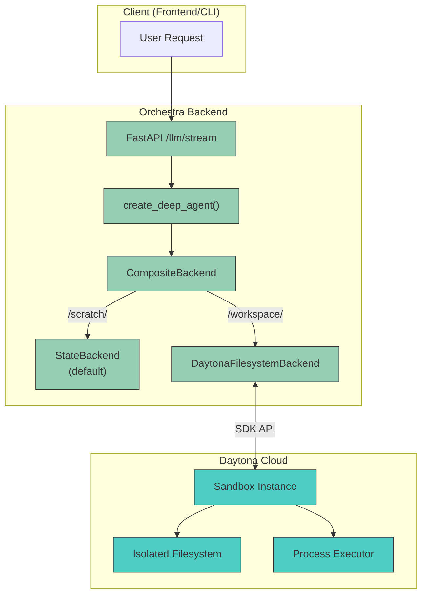
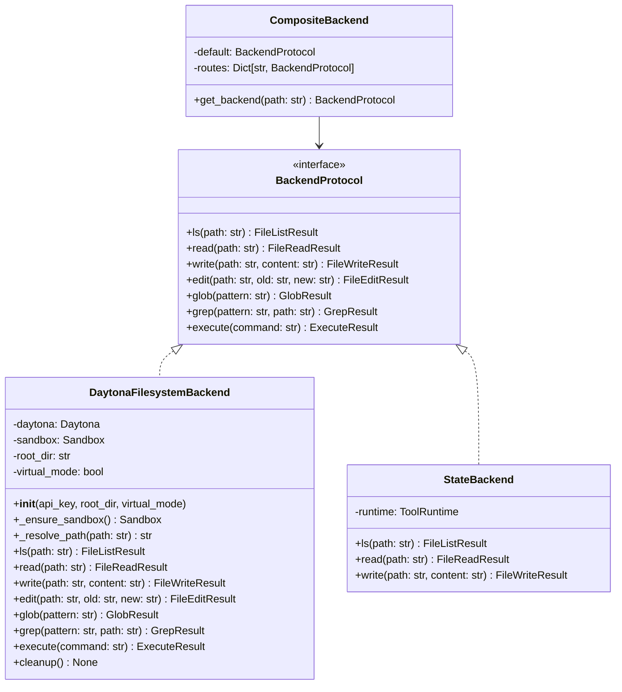
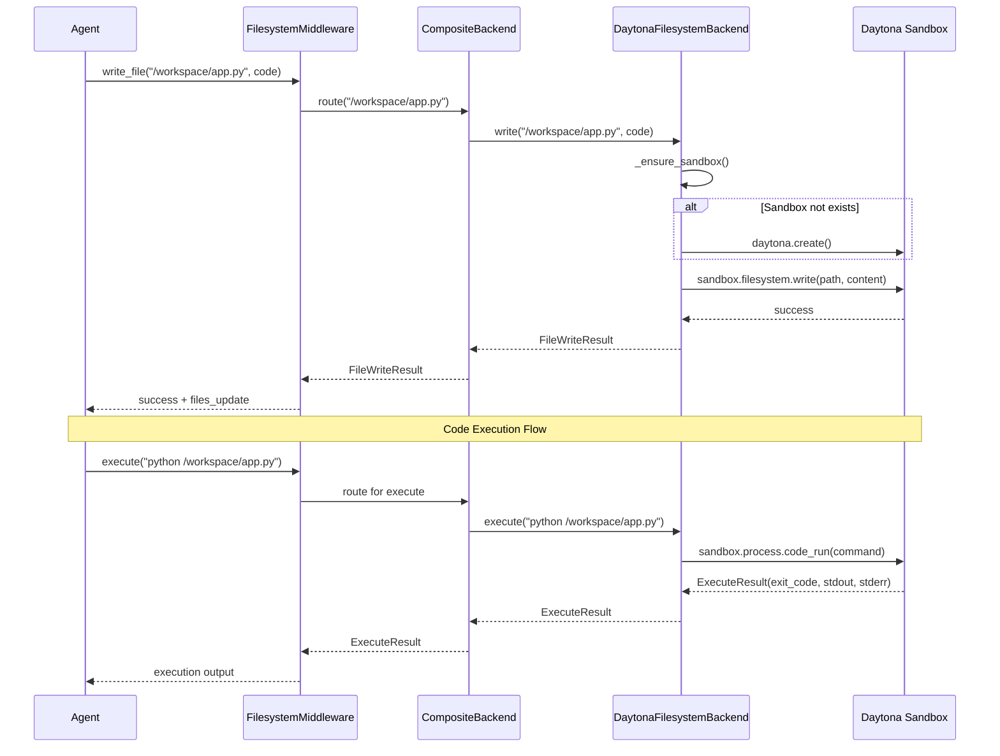

# Feature: FileSystem Backend with Daytona Integration

> **IMPORTANT**: Before implementing this feature, READ `/CLAUDE.md` first.

## Summary

Implement a `DaytonaFilesystemBackend` for Orchestra's `create_deep_agent` that provides secure, isolated filesystem and code execution capabilities using the Daytona sandbox infrastructure. This enables agents to read/write files and execute code in a sandboxed environment, protecting the host system from potentially harmful AI-generated code.

---

## Background & Research

### DeepAgents Backend Architecture

DeepAgents (v0.3.8) provides a pluggable backend system with the following core types:

| Backend Type | Description | Use Case |
|-------------|-------------|----------|
| **StateBackend** | Ephemeral storage in LangGraph state | Scratch pad for intermediate results |
| **StoreBackend** | Persistent storage via LangGraph store | Long-term memories, config |
| **FilesystemBackend** | Local disk storage with root_dir | Direct file access on host |
| **CompositeBackend** | Route-based hybrid storage | Mix backends by path prefix |
| **SandboxBackend** | Remote sandbox execution | Secure code execution |

**Source**: [DeepAgents GitHub](https://github.com/langchain-ai/deepagents), [LangChain Backends Docs](https://docs.langchain.com/oss/python/deepagents/backends)

### Daytona Platform

Daytona is a secure infrastructure for running AI-generated code with:

- **Sub-90ms sandbox creation** - Fast, ephemeral environments
- **Complete isolation** - No access to host infrastructure
- **Multi-language support** - Python, TypeScript, Go
- **File system operations** - Read, write, list files
- **Process execution** - Run shell commands and code
- **Git operations** - Clone repositories
- **Programmatic SDK** - Python and TypeScript clients

**Source**: [Daytona GitHub](https://github.com/daytonaio/daytona), [Daytona Docs](https://www.daytona.io/docs/en/process-code-execution/)

### LangChain Sandbox Integration

LangChain launched "Sandboxes for DeepAgents" supporting three providers:

1. **Daytona** - Secure infrastructure with fast startup
2. **Modal** - Serverless compute platform
3. **Runloop** - Development environments

**Source**: [LangChain Blog - Sandboxes for DeepAgents](https://www.blog.langchain.com/execute-code-with-sandboxes-for-deepagents/)

---

## User Stories

- As a **user**, I want my agent to execute code in a sandboxed environment so that my local system is protected from harmful code.
- As a **developer**, I want file operations to happen in an isolated sandbox so that agents cannot access sensitive local files.
- As a **platform operator**, I want to run multiple agents in parallel with complete isolation between their file systems.
- As a **security admin**, I want all code execution to happen in ephemeral environments that are destroyed after use.

---

## Acceptance Criteria

- [ ] `DaytonaFilesystemBackend` class implements `BackendProtocol` from deepagents
- [ ] Backend creates/manages Daytona sandboxes per agent session
- [ ] File operations (ls, read_file, write_file, edit_file, glob, grep) execute in sandbox
- [ ] Code execution (execute tool) runs in sandbox
- [ ] Sandboxes are cleaned up after agent session ends
- [ ] Backend can be configured via environment variables (`DAYTONA_API_KEY`)
- [ ] CompositeBackend can route specific paths to Daytona backend
- [ ] Integration with existing `create_deep_agent` flow works seamlessly
- [ ] Fallback to StateBackend when Daytona is not configured

---

## Technical Architecture

### System Overview



### Backend Protocol Implementation



### Data Flow



---

## Technical Requirements

### Dependencies

**Add to `backend/pyproject.toml`:**

```toml
dependencies = [
    # ... existing dependencies
    "daytona>=0.1.0",  # Daytona Python SDK
]
```

### Environment Variables

| Variable | Required | Default | Description |
|----------|----------|---------|-------------|
| `DAYTONA_API_KEY` | No | None | Daytona API key for sandbox access |
| `DAYTONA_ENABLED` | No | `false` | Enable Daytona sandbox backend |
| `DAYTONA_ROOT_DIR` | No | `/workspace` | Root directory in sandbox |
| `DAYTONA_SANDBOX_TTL` | No | `3600` | Sandbox TTL in seconds |

### File Structure

```
backend/src/
├── backends/
│   ├── __init__.py           # Package exports
│   ├── daytona.py            # DaytonaFilesystemBackend implementation
│   └── factory.py            # Backend factory functions
├── agents/
│   └── __init__.py           # Modified to use backend factory
└── controllers/
    └── llm.py                # Modified init_backend
```

---

## Implementation Plan

### Phase 1: Daytona Backend Implementation

**File: `backend/src/backends/__init__.py`** (NEW)

```python
"""Backend implementations for Orchestra agents."""
from src.backends.daytona import DaytonaFilesystemBackend
from src.backends.factory import create_backend, BackendType

__all__ = ["DaytonaFilesystemBackend", "create_backend", "BackendType"]
```

**File: `backend/src/backends/daytona.py`** (NEW)

```python
"""Daytona-based filesystem backend for secure code execution."""
import os
from typing import Optional
from dataclasses import dataclass

from daytona import Daytona, DaytonaConfig, CreateSandboxBaseParams
from deepagents.graph import BackendProtocol
from deepagents.middleware.filesystem import (
    FileListResult,
    FileReadResult,
    FileWriteResult,
    FileEditResult,
    GlobResult,
    GrepResult,
    ExecuteResult,
)

from src.utils.logger import logger


@dataclass
class DaytonaFilesystemBackend(BackendProtocol):
    """
    Filesystem backend that executes operations in a Daytona sandbox.

    This provides secure, isolated file operations and code execution
    for AI agents, preventing access to the host filesystem.

    Usage:
        backend = DaytonaFilesystemBackend(
            api_key=os.getenv("DAYTONA_API_KEY"),
            root_dir="/workspace",
        )

        # Use with create_deep_agent
        agent = create_deep_agent(
            backend=backend,
            ...
        )
    """

    api_key: str
    root_dir: str = "/workspace"
    virtual_mode: bool = True
    sandbox_language: str = "python"
    _daytona: Optional[Daytona] = None
    _sandbox: Optional[object] = None

    def __post_init__(self):
        if not self.api_key:
            raise ValueError("DAYTONA_API_KEY is required for DaytonaFilesystemBackend")
        self._daytona = Daytona(DaytonaConfig(api_key=self.api_key))

    def _ensure_sandbox(self):
        """Create sandbox if not exists."""
        if self._sandbox is None:
            logger.info("Creating Daytona sandbox...")
            self._sandbox = self._daytona.create(
                CreateSandboxBaseParams(language=self.sandbox_language)
            )
            logger.info(f"Sandbox created: {self._sandbox.id}")
        return self._sandbox

    def _resolve_path(self, path: str) -> str:
        """Resolve path within sandbox root directory."""
        if self.virtual_mode:
            # Normalize and join with root_dir
            clean_path = path.lstrip("/")
            return f"{self.root_dir}/{clean_path}"
        return path

    def ls(self, path: str = ".") -> FileListResult:
        """List directory contents in sandbox."""
        sandbox = self._ensure_sandbox()
        resolved = self._resolve_path(path)

        try:
            result = sandbox.process.code_run(f"import os; print(os.listdir('{resolved}'))")
            if result.exit_code != 0:
                return FileListResult(error=result.result)
            # Parse the list output
            import ast
            files = ast.literal_eval(result.result.strip())
            return FileListResult(files=files)
        except Exception as e:
            logger.error(f"ls error: {e}")
            return FileListResult(error=str(e))

    def read(self, path: str, offset: int = 0, limit: int = 2000) -> FileReadResult:
        """Read file contents from sandbox."""
        sandbox = self._ensure_sandbox()
        resolved = self._resolve_path(path)

        try:
            code = f"""
with open('{resolved}', 'r') as f:
    lines = f.readlines()[{offset}:{offset + limit}]
    print(''.join(lines), end='')
"""
            result = sandbox.process.code_run(code)
            if result.exit_code != 0:
                return FileReadResult(error=result.result)
            return FileReadResult(content=result.result)
        except Exception as e:
            logger.error(f"read error: {e}")
            return FileReadResult(error=str(e))

    def write(self, path: str, content: str) -> FileWriteResult:
        """Write file contents to sandbox."""
        sandbox = self._ensure_sandbox()
        resolved = self._resolve_path(path)

        try:
            # Escape content for safe string embedding
            escaped = content.replace("\\", "\\\\").replace("'''", "\\'\\'\\'")
            code = f"""
import os
os.makedirs(os.path.dirname('{resolved}') or '.', exist_ok=True)
with open('{resolved}', 'w') as f:
    f.write('''{escaped}''')
print('success')
"""
            result = sandbox.process.code_run(code)
            if result.exit_code != 0:
                return FileWriteResult(error=result.result)

            # Return files_update for state management
            return FileWriteResult(
                files_update={path: {"content": content.splitlines()}}
            )
        except Exception as e:
            logger.error(f"write error: {e}")
            return FileWriteResult(error=str(e))

    def edit(self, path: str, old_string: str, new_string: str) -> FileEditResult:
        """Edit file by replacing string in sandbox."""
        sandbox = self._ensure_sandbox()
        resolved = self._resolve_path(path)

        try:
            old_escaped = old_string.replace("\\", "\\\\").replace("'''", "\\'\\'\\'")
            new_escaped = new_string.replace("\\", "\\\\").replace("'''", "\\'\\'\\'")

            code = f"""
with open('{resolved}', 'r') as f:
    content = f.read()
if '''{old_escaped}''' not in content:
    raise ValueError('old_string not found')
new_content = content.replace('''{old_escaped}''', '''{new_escaped}''', 1)
with open('{resolved}', 'w') as f:
    f.write(new_content)
print(new_content)
"""
            result = sandbox.process.code_run(code)
            if result.exit_code != 0:
                return FileEditResult(error=result.result)

            return FileEditResult(
                content=result.result,
                files_update={path: {"content": result.result.splitlines()}}
            )
        except Exception as e:
            logger.error(f"edit error: {e}")
            return FileEditResult(error=str(e))

    def glob(self, pattern: str, path: str = ".") -> GlobResult:
        """Find files matching pattern in sandbox."""
        sandbox = self._ensure_sandbox()
        resolved = self._resolve_path(path)

        try:
            code = f"""
import glob
import os
os.chdir('{resolved}')
matches = glob.glob('{pattern}', recursive=True)
print('\\n'.join(matches))
"""
            result = sandbox.process.code_run(code)
            if result.exit_code != 0:
                return GlobResult(error=result.result)

            files = [f for f in result.result.strip().split('\n') if f]
            return GlobResult(files=files)
        except Exception as e:
            logger.error(f"glob error: {e}")
            return GlobResult(error=str(e))

    def grep(self, pattern: str, path: str = ".", include: str = "*") -> GrepResult:
        """Search for pattern in files within sandbox."""
        sandbox = self._ensure_sandbox()
        resolved = self._resolve_path(path)

        try:
            code = f"""
import subprocess
result = subprocess.run(
    ['grep', '-r', '-n', '{pattern}', '{resolved}', '--include={include}'],
    capture_output=True, text=True
)
print(result.stdout)
"""
            result = sandbox.process.code_run(code)
            # grep returns non-zero if no matches, which is not an error
            return GrepResult(matches=result.result.strip().split('\n') if result.result.strip() else [])
        except Exception as e:
            logger.error(f"grep error: {e}")
            return GrepResult(error=str(e))

    def execute(self, command: str) -> ExecuteResult:
        """Execute shell command in sandbox."""
        sandbox = self._ensure_sandbox()

        try:
            code = f"""
import subprocess
import os
os.chdir('{self.root_dir}')
result = subprocess.run(
    {repr(command)},
    shell=True,
    capture_output=True,
    text=True
)
print(f"EXIT_CODE:{{result.returncode}}")
print("STDOUT:", result.stdout)
print("STDERR:", result.stderr)
"""
            result = sandbox.process.code_run(code)

            # Parse the output
            lines = result.result.split('\n')
            exit_code = 0
            stdout = ""
            stderr = ""

            for i, line in enumerate(lines):
                if line.startswith("EXIT_CODE:"):
                    exit_code = int(line.split(":")[1])
                elif line.startswith("STDOUT:"):
                    stdout = '\n'.join(lines[i+1:]).split("STDERR:")[0].strip()
                    break

            if "STDERR:" in result.result:
                stderr = result.result.split("STDERR:")[1].strip()

            return ExecuteResult(
                exit_code=exit_code,
                stdout=stdout,
                stderr=stderr,
            )
        except Exception as e:
            logger.error(f"execute error: {e}")
            return ExecuteResult(exit_code=1, stdout="", stderr=str(e))

    def cleanup(self):
        """Clean up sandbox resources."""
        if self._sandbox is not None:
            try:
                logger.info(f"Deleting sandbox: {self._sandbox.id}")
                self._daytona.delete(self._sandbox)
                self._sandbox = None
            except Exception as e:
                logger.error(f"Failed to delete sandbox: {e}")

    def __del__(self):
        """Ensure cleanup on garbage collection."""
        self.cleanup()
```

---

### Phase 2: Backend Factory

**File: `backend/src/backends/factory.py`** (NEW)

```python
"""Factory functions for creating agent backends."""
import os
from enum import Enum
from typing import Callable, Optional

from deepagents.backends import CompositeBackend, StateBackend, FilesystemBackend
from langchain.tools import ToolRuntime

from src.utils.logger import logger


class BackendType(Enum):
    """Available backend types."""
    STATE = "state"          # In-memory ephemeral
    FILESYSTEM = "filesystem"  # Local disk
    DAYTONA = "daytona"       # Daytona sandbox


def create_daytona_backend(
    api_key: Optional[str] = None,
    root_dir: str = "/workspace",
) -> "DaytonaFilesystemBackend":
    """Create a Daytona-based filesystem backend.

    Args:
        api_key: Daytona API key. Falls back to DAYTONA_API_KEY env var.
        root_dir: Root directory within sandbox.

    Returns:
        DaytonaFilesystemBackend instance.

    Raises:
        ValueError: If no API key is available.
    """
    from src.backends.daytona import DaytonaFilesystemBackend

    key = api_key or os.getenv("DAYTONA_API_KEY")
    if not key:
        raise ValueError(
            "Daytona API key required. Set DAYTONA_API_KEY environment variable "
            "or pass api_key parameter."
        )

    return DaytonaFilesystemBackend(
        api_key=key,
        root_dir=root_dir,
    )


def create_composite_backend_with_daytona(
    runtime: ToolRuntime,
    workspace_routes: Optional[dict] = None,
) -> CompositeBackend:
    """Create a CompositeBackend with Daytona for workspace operations.

    This creates a hybrid backend where:
    - /workspace/* routes to Daytona sandbox (secure execution)
    - /scratch/* routes to StateBackend (ephemeral)
    - Other paths use StateBackend as default

    Args:
        runtime: LangGraph tool runtime context.
        workspace_routes: Additional routes to Daytona paths.

    Returns:
        CompositeBackend with Daytona integration.
    """
    daytona_enabled = os.getenv("DAYTONA_ENABLED", "false").lower() == "true"

    routes = {}

    if daytona_enabled:
        try:
            daytona_backend = create_daytona_backend()
            routes["/workspace/"] = daytona_backend

            # Add custom workspace routes
            if workspace_routes:
                for prefix, _ in workspace_routes.items():
                    routes[prefix] = daytona_backend

            logger.info("Daytona backend enabled for /workspace/ paths")
        except ValueError as e:
            logger.warning(f"Daytona backend not available: {e}")

    return CompositeBackend(
        default=StateBackend(runtime),
        routes=routes,
    )


def create_backend(
    backend_type: BackendType,
    runtime: Optional[ToolRuntime] = None,
    **kwargs,
) -> "BackendProtocol":
    """Factory function to create backends by type.

    Args:
        backend_type: Type of backend to create.
        runtime: Tool runtime (required for StateBackend).
        **kwargs: Additional arguments for specific backend types.

    Returns:
        Backend instance implementing BackendProtocol.
    """
    if backend_type == BackendType.STATE:
        if runtime is None:
            raise ValueError("runtime is required for StateBackend")
        return StateBackend(runtime)

    elif backend_type == BackendType.FILESYSTEM:
        root_dir = kwargs.get("root_dir", ".")
        virtual_mode = kwargs.get("virtual_mode", True)
        return FilesystemBackend(root_dir=root_dir, virtual_mode=virtual_mode)

    elif backend_type == BackendType.DAYTONA:
        return create_daytona_backend(
            api_key=kwargs.get("api_key"),
            root_dir=kwargs.get("root_dir", "/workspace"),
        )

    else:
        raise ValueError(f"Unknown backend type: {backend_type}")
```

---

### Phase 3: Integration with LLM Controller

**File: `backend/src/controllers/llm.py`** (MODIFY)

Update `init_backend` method to support Daytona:

```python
from src.backends.factory import create_composite_backend_with_daytona

def init_backend(self, request: LLMRequest) -> CompositeBackend:
    """Initialize backend with optional Daytona support."""
    runtime = self._init_runtime(request)

    # Check if Daytona is enabled
    daytona_enabled = os.getenv("DAYTONA_ENABLED", "false").lower() == "true"

    if daytona_enabled:
        return create_composite_backend_with_daytona(runtime)

    # Fallback to existing behavior
    store_backend = StoreBackend(runtime)
    built_routes = {
        f"/users/{runtime.context.user_id}/memories/": store_backend,
        f"/users/{runtime.context.user_id}/config/": store_backend,
    }
    return CompositeBackend(default=StateBackend(runtime), routes=built_routes)
```

---

### Phase 4: Sandbox Lifecycle Management

**File: `backend/src/backends/sandbox_manager.py`** (NEW)

```python
"""Sandbox lifecycle management for agent sessions."""
import asyncio
from typing import Dict, Optional
from dataclasses import dataclass, field
from contextlib import asynccontextmanager

from src.backends.daytona import DaytonaFilesystemBackend
from src.utils.logger import logger


@dataclass
class SandboxSession:
    """Tracks a sandbox session for an agent."""
    thread_id: str
    backend: DaytonaFilesystemBackend
    created_at: float = field(default_factory=lambda: asyncio.get_event_loop().time())
    last_used: float = field(default_factory=lambda: asyncio.get_event_loop().time())


class SandboxManager:
    """Manages sandbox lifecycle across agent sessions.

    Features:
    - Reuses sandboxes within the same thread
    - Automatic cleanup after TTL expiration
    - Graceful cleanup on shutdown
    """

    def __init__(self, ttl_seconds: int = 3600):
        self.ttl_seconds = ttl_seconds
        self._sessions: Dict[str, SandboxSession] = {}
        self._cleanup_task: Optional[asyncio.Task] = None

    async def get_or_create(self, thread_id: str, **kwargs) -> DaytonaFilesystemBackend:
        """Get existing sandbox or create new one for thread."""
        if thread_id in self._sessions:
            session = self._sessions[thread_id]
            session.last_used = asyncio.get_event_loop().time()
            return session.backend

        # Create new sandbox
        backend = DaytonaFilesystemBackend(**kwargs)
        self._sessions[thread_id] = SandboxSession(
            thread_id=thread_id,
            backend=backend,
        )

        logger.info(f"Created sandbox for thread {thread_id}")
        return backend

    async def cleanup_expired(self):
        """Clean up sandboxes that have exceeded TTL."""
        current_time = asyncio.get_event_loop().time()
        expired = [
            tid for tid, session in self._sessions.items()
            if current_time - session.last_used > self.ttl_seconds
        ]

        for thread_id in expired:
            await self.cleanup_session(thread_id)

    async def cleanup_session(self, thread_id: str):
        """Clean up a specific session."""
        if thread_id in self._sessions:
            session = self._sessions.pop(thread_id)
            session.backend.cleanup()
            logger.info(f"Cleaned up sandbox for thread {thread_id}")

    async def cleanup_all(self):
        """Clean up all sandboxes."""
        for thread_id in list(self._sessions.keys()):
            await self.cleanup_session(thread_id)

    @asynccontextmanager
    async def session(self, thread_id: str, **kwargs):
        """Context manager for sandbox session."""
        backend = await self.get_or_create(thread_id, **kwargs)
        try:
            yield backend
        finally:
            # Don't cleanup immediately - let TTL handle it
            pass

    async def start_cleanup_loop(self, interval: int = 300):
        """Start background cleanup loop."""
        async def loop():
            while True:
                await asyncio.sleep(interval)
                await self.cleanup_expired()

        self._cleanup_task = asyncio.create_task(loop())

    async def stop_cleanup_loop(self):
        """Stop background cleanup loop."""
        if self._cleanup_task:
            self._cleanup_task.cancel()
            try:
                await self._cleanup_task
            except asyncio.CancelledError:
                pass
        await self.cleanup_all()


# Global sandbox manager instance
sandbox_manager = SandboxManager()
```

---

## Testing Strategy

### Unit Tests

**File: `backend/tests/unit/backends/test_daytona.py`**

```python
"""Unit tests for DaytonaFilesystemBackend."""
import pytest
from unittest.mock import Mock, patch, MagicMock


class TestDaytonaFilesystemBackend:
    """Tests for DaytonaFilesystemBackend."""

    @pytest.fixture
    def mock_daytona(self):
        """Mock Daytona SDK."""
        with patch("src.backends.daytona.Daytona") as mock:
            instance = mock.return_value
            sandbox = MagicMock()
            sandbox.id = "test-sandbox-123"
            instance.create.return_value = sandbox
            yield instance, sandbox

    def test_init_requires_api_key(self):
        """Backend requires API key."""
        with pytest.raises(ValueError, match="DAYTONA_API_KEY"):
            from src.backends.daytona import DaytonaFilesystemBackend
            DaytonaFilesystemBackend(api_key=None)

    def test_init_with_api_key(self, mock_daytona):
        """Backend initializes with API key."""
        from src.backends.daytona import DaytonaFilesystemBackend
        backend = DaytonaFilesystemBackend(api_key="test-key")
        assert backend.api_key == "test-key"

    def test_sandbox_created_lazily(self, mock_daytona):
        """Sandbox is created on first operation."""
        daytona, sandbox = mock_daytona
        from src.backends.daytona import DaytonaFilesystemBackend

        backend = DaytonaFilesystemBackend(api_key="test-key")
        assert backend._sandbox is None

        sandbox.process.code_run.return_value = Mock(exit_code=0, result="['file1.py']")
        backend.ls("/")

        assert backend._sandbox is not None
        daytona.create.assert_called_once()

    def test_path_resolution_virtual_mode(self, mock_daytona):
        """Paths are resolved within root_dir in virtual mode."""
        from src.backends.daytona import DaytonaFilesystemBackend

        backend = DaytonaFilesystemBackend(
            api_key="test-key",
            root_dir="/workspace",
            virtual_mode=True,
        )

        assert backend._resolve_path("/app.py") == "/workspace/app.py"
        assert backend._resolve_path("src/main.py") == "/workspace/src/main.py"

    def test_write_creates_files_update(self, mock_daytona):
        """Write returns files_update for state management."""
        _, sandbox = mock_daytona
        sandbox.process.code_run.return_value = Mock(exit_code=0, result="success")

        from src.backends.daytona import DaytonaFilesystemBackend
        backend = DaytonaFilesystemBackend(api_key="test-key")

        result = backend.write("/app.py", "print('hello')")

        assert result.error is None
        assert result.files_update is not None
        assert "/app.py" in result.files_update

    def test_cleanup_deletes_sandbox(self, mock_daytona):
        """Cleanup deletes the sandbox."""
        daytona, sandbox = mock_daytona
        sandbox.process.code_run.return_value = Mock(exit_code=0, result="[]")

        from src.backends.daytona import DaytonaFilesystemBackend
        backend = DaytonaFilesystemBackend(api_key="test-key")
        backend.ls("/")  # Force sandbox creation

        backend.cleanup()

        daytona.delete.assert_called_once_with(sandbox)
        assert backend._sandbox is None


class TestDaytonaExecute:
    """Tests for execute command functionality."""

    def test_execute_returns_result(self):
        """Execute returns exit code and output."""
        with patch("src.backends.daytona.Daytona") as mock_daytona:
            sandbox = MagicMock()
            sandbox.id = "test-sandbox"
            mock_daytona.return_value.create.return_value = sandbox

            sandbox.process.code_run.return_value = Mock(
                exit_code=0,
                result="EXIT_CODE:0\nSTDOUT: hello world\nSTDERR: "
            )

            from src.backends.daytona import DaytonaFilesystemBackend
            backend = DaytonaFilesystemBackend(api_key="test-key")

            result = backend.execute("echo 'hello world'")

            assert result.exit_code == 0
            assert "hello" in result.stdout


class TestBackendFactory:
    """Tests for backend factory functions."""

    def test_create_daytona_backend_from_env(self):
        """Factory creates backend from env var."""
        with patch.dict("os.environ", {"DAYTONA_API_KEY": "env-key"}):
            with patch("src.backends.daytona.Daytona"):
                from src.backends.factory import create_daytona_backend
                backend = create_daytona_backend()
                assert backend.api_key == "env-key"

    def test_create_daytona_backend_explicit_key(self):
        """Factory uses explicit key over env var."""
        with patch.dict("os.environ", {"DAYTONA_API_KEY": "env-key"}):
            with patch("src.backends.daytona.Daytona"):
                from src.backends.factory import create_daytona_backend
                backend = create_daytona_backend(api_key="explicit-key")
                assert backend.api_key == "explicit-key"
```

### Integration Tests

**File: `backend/tests/integration/test_daytona_integration.py`**

```python
"""Integration tests for Daytona backend with real sandbox."""
import os
import pytest

# Skip if no Daytona API key
pytestmark = pytest.mark.skipif(
    not os.getenv("DAYTONA_API_KEY"),
    reason="DAYTONA_API_KEY not set"
)


class TestDaytonaIntegration:
    """Integration tests with real Daytona sandbox."""

    @pytest.fixture
    def backend(self):
        """Create backend and cleanup after test."""
        from src.backends.daytona import DaytonaFilesystemBackend

        backend = DaytonaFilesystemBackend(
            api_key=os.getenv("DAYTONA_API_KEY"),
            root_dir="/workspace",
        )
        yield backend
        backend.cleanup()

    def test_write_and_read_file(self, backend):
        """Write file and read it back."""
        content = "print('Hello from Daytona!')"

        write_result = backend.write("/app.py", content)
        assert write_result.error is None

        read_result = backend.read("/app.py")
        assert read_result.error is None
        assert "Hello from Daytona" in read_result.content

    def test_execute_python(self, backend):
        """Execute Python code in sandbox."""
        backend.write("/test.py", "print(2 + 2)")

        result = backend.execute("python /workspace/test.py")

        assert result.exit_code == 0
        assert "4" in result.stdout

    def test_glob_pattern(self, backend):
        """Find files matching pattern."""
        backend.write("/src/main.py", "# main")
        backend.write("/src/utils.py", "# utils")
        backend.write("/README.md", "# README")

        result = backend.glob("**/*.py")

        assert len(result.files) >= 2
        assert any("main.py" in f for f in result.files)
```

---

## File Summary

| File | Action | Description |
|------|--------|-------------|
| `backend/pyproject.toml` | MODIFY | Add `daytona` dependency |
| `backend/src/backends/__init__.py` | CREATE | Package exports |
| `backend/src/backends/daytona.py` | CREATE | DaytonaFilesystemBackend implementation |
| `backend/src/backends/factory.py` | CREATE | Backend factory functions |
| `backend/src/backends/sandbox_manager.py` | CREATE | Sandbox lifecycle management |
| `backend/src/controllers/llm.py` | MODIFY | Integrate Daytona backend option |
| `backend/tests/unit/backends/test_daytona.py` | CREATE | Unit tests |
| `backend/tests/integration/test_daytona_integration.py` | CREATE | Integration tests |

---

## Configuration Examples

### Docker Compose with Daytona

```yaml
services:
  api:
    environment:
      - DAYTONA_ENABLED=true
      - DAYTONA_API_KEY=${DAYTONA_API_KEY}
      - DAYTONA_ROOT_DIR=/workspace
```

### CompositeBackend Route Configuration

```python
# Route /workspace to Daytona, /memories to Store
composite_backend = CompositeBackend(
    default=StateBackend(runtime),
    routes={
        "/workspace/": daytona_backend,
        "/memories/": store_backend,
        "/config/": store_backend,
    },
)
```

---

## Security Considerations

1. **API Key Protection**: `DAYTONA_API_KEY` should be stored in secrets management, not in code or git.

2. **Sandbox Isolation**: Each sandbox is completely isolated from the host and other sandboxes.

3. **Path Validation**: `virtual_mode=True` ensures paths cannot escape root_dir.

4. **TTL Expiration**: Sandboxes are automatically cleaned up after inactivity.

5. **No Network Access by Default**: Sandboxes can be configured to restrict network access.

---

## Dependencies

- `daytona>=0.1.0` - Daytona Python SDK
- `deepagents==0.3.8` - Already installed
- `langchain-sandbox>=0.0.3` - Already installed

---

## Out of Scope

- Multi-language sandbox support beyond Python (future enhancement)
- Persistent file storage across sessions (use StoreBackend for that)
- Sandbox resource limits configuration (handled by Daytona)
- Custom Daytona images (requires Daytona Pro features)
- Modal and Runloop integration (can be added separately)

---

## Success Metrics

- Agents can execute code safely without host system access
- File operations complete within 200ms (excluding initial sandbox creation)
- Sandbox creation time < 500ms (per Daytona guarantees)
- Zero security incidents from AI-generated code
- Sandbox cleanup rate > 99% (no orphaned resources)

---

## References

- [DeepAgents GitHub Repository](https://github.com/langchain-ai/deepagents)
- [LangChain Backends Documentation](https://docs.langchain.com/oss/python/deepagents/backends)
- [Daytona Documentation](https://www.daytona.io/docs/en/)
- [Daytona GitHub Repository](https://github.com/daytonaio/daytona)
- [LangChain Blog - Sandboxes for DeepAgents](https://www.blog.langchain.com/execute-code-with-sandboxes-for-deepagents/)
- [LangChain Sandbox PyPI](https://pypi.org/project/langchain-sandbox/)
- [DeepAgents PyPI](https://pypi.org/project/deepagents/)
