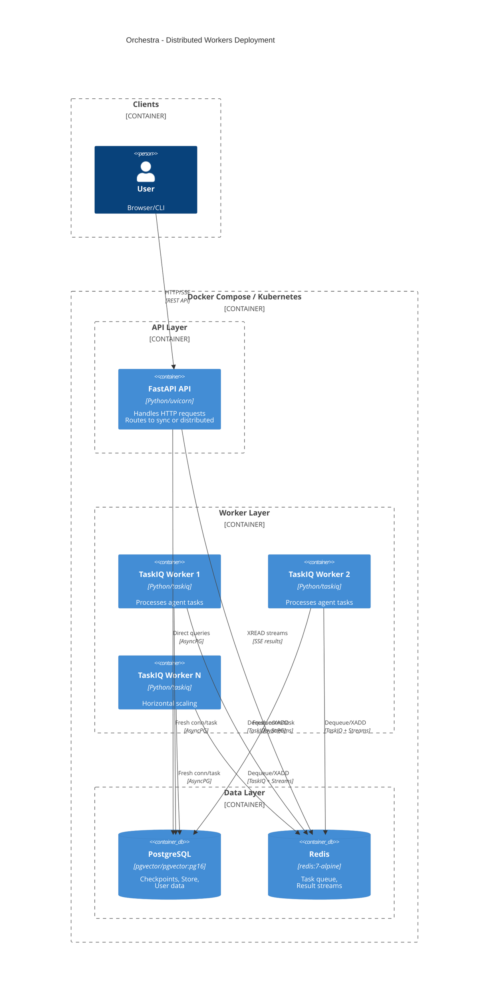
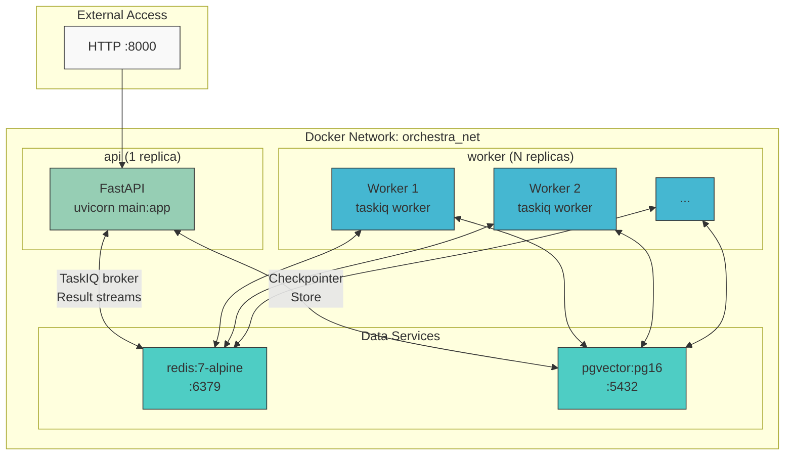
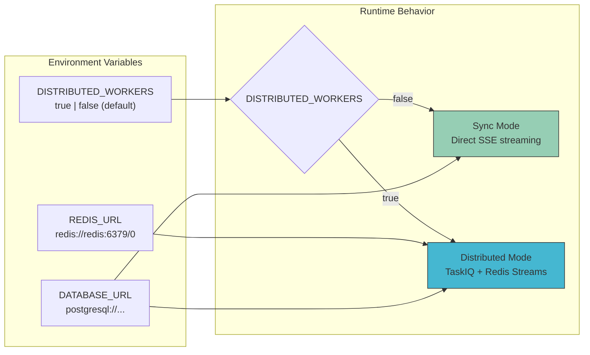
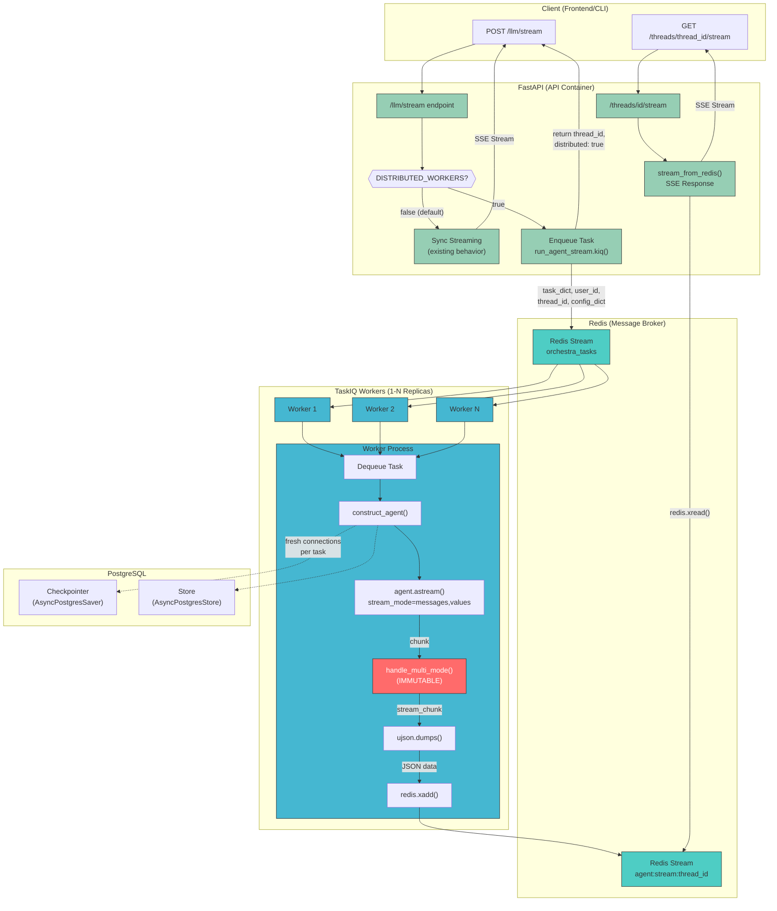
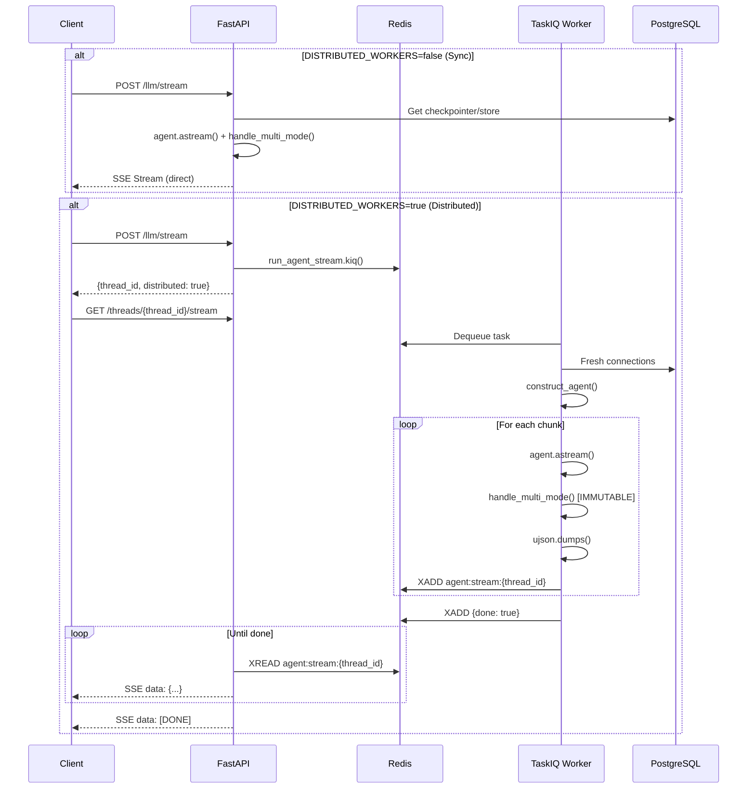
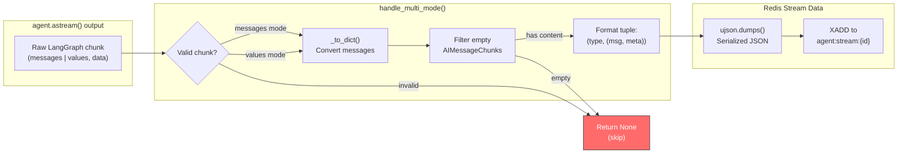

# Feature: distributed-workers-taskiq (656)

> **IMPORTANT**: Before implementing this feature, READ `/CLAUDE.md` first.

## Summary

Refactor the current single container deployment architecture to a distributed system with separate workers (using TaskIQ) and API (FastAPI). This will enable horizontal scaling of background task processing independent of API capacity, improve fault tolerance, and allow for more efficient resource utilization.

## User Stories

- As a **platform operator**, I want to scale worker processes independently from API processes so that I can handle varying workloads without over-provisioning.
- As a **developer**, I want background tasks to be processed by dedicated workers so that API response times remain fast under heavy load.
- As a **system administrator**, I want a distributed architecture so that a worker failure doesn't bring down the entire application.

## Acceptance Criteria

- [ ] API (FastAPI) runs as a standalone container/service
- [ ] Workers (TaskIQ) run as separate container(s)/service(s)
- [ ] Tasks can be enqueued from API and processed by workers
- [ ] Workers can scale horizontally (multiple replicas)
- [ ] Redis facilitates communication between API and workers
- [ ] Health checks exist for both API and worker services
- [ ] Existing functionality remains intact after migration
- [ ] Docker Compose configuration supports local development with distributed setup

## Technical Requirements

- **Message Broker**: Redis Streams via `taskiq-redis`
- **TaskIQ Integration**: `RedisStreamBroker` with `RedisAsyncResultBackend`
- **Shared Dependencies**: Database connections re-established per task (existing pattern from `scheduled_llm_invoke`)
- **Configuration**: `REDIS_URL`, `DISTRIBUTED_WORKERS` environment variables
- **Streaming**: Redis Streams + SSE for real-time output delivery
- **Graceful Shutdown**: TaskIQ handles SIGTERM natively

---

## Architecture

### Application Deployment Diagram



### Service Topology



### Environment Configuration



---

### Final System Architecture



### Data Flow Summary



### Stream Chunk Format



---

## Critical Constraints

### `handle_multi_mode` is IMMUTABLE

**DO NOT MODIFY** the `handle_multi_mode` function in `backend/src/utils/stream.py:145-173`.

This function is the **authoritative formatter** for LangGraph's `stream_mode=["messages", "values"]` output.

#### Output Format (from log files)

**Messages mode** - `["messages", [message_chunk, metadata]]`:
```json
["messages",[
  {"content":"...", "type":"AIMessageChunk", "tool_calls":[...], ...},
  {"user_id":"...", "thread_id":"...", "langgraph_step":5, "ls_provider":"anthropic", ...}
]]
```

**Values mode** - `["values", {messages, files, todos}]`:
```json
["values",{
  "messages":[{"content":"...", "type":"human", ...}, {"content":"...", "type":"ai", ...}],
  "files":{"/path":{"content":[...]}},
  "todos":[]
}]
```

#### What `handle_multi_mode` does:
- Converts `AIMessageChunk` and `ToolMessage` to serializable dicts via `_to_dict()`
- Filters empty chunks (no content, no tool calls, no stop reason)
- Returns `None` for filtered chunks, tuple `(stream_type, (message_dict, metadata))` otherwise
- Logs warnings for empty/invalid chunks

```python
# backend/src/utils/stream.py:145-173 - DO NOT CHANGE
def handle_multi_mode(chunk: dict):
    """Processes LangGraph stream chunks into standardized format."""
    # ... existing implementation ...
```

The distributed worker task **MUST** use `handle_multi_mode` to process chunks before writing to Redis, ensuring format consistency between sync and distributed streaming.

---

## Minimal Implementation Plan

### Phase 1: Dependencies and Broker Configuration

**File: `backend/pyproject.toml`**
Add dependency:
```toml
taskiq-redis = "^1.0.0"
```

**File: `backend/src/workers/broker.py`** (NEW)
```python
import os
from taskiq_redis import RedisStreamBroker, RedisAsyncResultBackend

REDIS_URL = os.getenv("REDIS_URL", "redis://localhost:6379/0")

result_backend = RedisAsyncResultBackend(
    redis_url=REDIS_URL,
    result_ex_time=300,  # 5 minute TTL
)

broker = RedisStreamBroker(
    url=REDIS_URL,
    queue_name="orchestra_tasks",
).with_result_backend(result_backend)
```

---

### Phase 2: Task Definitions

**File: `backend/src/workers/tasks.py`** (NEW)

```python
"""TaskIQ task definitions for distributed agent execution."""
import ujson
import redis.asyncio as redis
from src.workers.broker import broker, REDIS_URL

@broker.task(task_name="run_agent_stream")
async def run_agent_stream(
    task_dict: dict,
    user_id: str,
    thread_id: str,
    config_dict: dict,
) -> dict:
    """
    Execute agent and stream results via Redis Streams.

    Pattern mirrors existing `scheduled_llm_invoke` in services/schedule.py:
    - Reconstructs all objects from serializable dicts
    - Creates fresh DB connections inside the task
    - Uses handle_multi_mode for LangGraph format consistency
    - Writes streaming output to Redis stream
    """
    from src.schemas.entities import LLMRequest
    from src.flows import construct_agent
    from src.services.db import get_checkpoint_db, get_store_db
    from src.contexts.service import ServiceContext
    from src.utils.stream import handle_multi_mode  # CRITICAL: Use existing formatter
    from src.utils.logger import logger

    stream_key = f"agent:stream:{thread_id}"
    redis_client = redis.from_url(REDIS_URL)

    try:
        # Reconstruct request from dict (same pattern as scheduled_llm_invoke)
        params = LLMRequest(**task_dict)
        params.metadata.user_id = user_id
        params.metadata.thread_id = thread_id

        async with (
            get_store_db() as store,
            get_checkpoint_db() as checkpointer,
        ):
            service_context = ServiceContext(
                user_id=user_id,
                store=store,
                config=config_dict,
                checkpointer=checkpointer,
            )

            agent = await construct_agent(
                params=params,
                service_context=service_context,
            )

            # Stream to Redis using handle_multi_mode for format consistency
            async for chunk in agent.astream(
                params.input,
                stream_mode=["messages", "values"],
                config=config_dict,
            ):
                # CRITICAL: Use handle_multi_mode to maintain LangGraph format
                stream_chunk = handle_multi_mode(chunk)
                if stream_chunk:
                    # Serialize to JSON and push to Redis stream
                    data = ujson.dumps(stream_chunk)
                    await redis_client.xadd(stream_key, {"data": data})

            # Signal completion
            await redis_client.xadd(stream_key, {"done": "true"})
            await redis_client.expire(stream_key, 300)  # 5 min TTL

        return {"status": "complete", "stream_key": stream_key}

    except Exception as e:
        logger.exception(f"Task failed: {e}")
        await redis_client.xadd(stream_key, {"error": str(e), "done": "true"})
        raise
    finally:
        await redis_client.aclose()
```

---

### Phase 3: API Integration (Minimal Schema Changes)

**Design Decision**: Instead of new `/llm/stream/distributed` endpoint, leverage existing `/threads` resource:
- `POST /llm/stream` - Optionally enqueue to worker when `DISTRIBUTED_WORKERS=true`
- `GET /threads/{thread_id}/stream` - Consume distributed results via SSE

This approach:
- Fits naturally with existing `/threads` API
- No new top-level routes
- Backward compatible (sync streaming when `DISTRIBUTED_WORKERS=false`)

---

**File: `backend/src/routes/v0/llm.py`** (MODIFY)

Conditionally route to distributed workers:

```python
import os
from src.workers.tasks import run_agent_stream

DISTRIBUTED_WORKERS = os.getenv("DISTRIBUTED_WORKERS", "false").lower() == "true"

@llm_router.post("/stream")
async def llm_stream(
    request: Request,
    params: LLMRequest,
    user: UserDep,
    store: StoreDep,
):
    """Stream agent response - uses distributed workers when enabled."""
    thread_id = params.metadata.thread_id or str(uuid4())

    if DISTRIBUTED_WORKERS:
        # Enqueue to TaskIQ worker
        config = init_config(params, user.id)
        await run_agent_stream.kiq(
            task_dict=params.model_dump(),
            user_id=str(user.id),
            thread_id=thread_id,
            config_dict=config,
        )
        # Return thread_id for client to poll /threads/{thread_id}/stream
        return {"thread_id": thread_id, "distributed": True}

    # Existing synchronous streaming behavior
    llm_controller = LLMController(user.id, store, config)
    assistant = await llm_controller.llm_stream(params)
    return StreamingResponse(assistant, media_type="text/event-stream")
```

---

**File: `backend/src/routes/v0/thread.py`** (MODIFY)

Add streaming endpoint to existing thread router:

```python
from fastapi.responses import StreamingResponse
from src.utils.stream import stream_from_redis

@router.get(
    "/threads/{thread_id}/stream",
    name="Stream Thread Results",
    operation_id="ruska_stream_thread",
    tags=["Thread"],
)
async def stream_thread(
    thread_id: str,
    user: ProtectedUser = Depends(verify_credentials),
):
    """
    Stream results from a distributed worker via SSE.

    Use this endpoint after POST /llm/stream returns {"distributed": true}.
    """
    return StreamingResponse(
        stream_from_redis(thread_id),
        media_type="text/event-stream",
    )
```

---

**File: `backend/src/utils/stream.py`** (MODIFY)

Add Redis stream consumer:

```python
import redis.asyncio as redis
from src.workers.broker import REDIS_URL

async def stream_from_redis(thread_id: str):
    """Consume Redis stream and yield SSE events."""
    stream_key = f"agent:stream:{thread_id}"
    redis_client = redis.from_url(REDIS_URL)
    last_id = "0"

    try:
        while True:
            messages = await redis_client.xread(
                {stream_key: last_id},
                block=5000,  # 5 second timeout
            )

            if not messages:
                continue

            for stream, entries in messages:
                for entry_id, data in entries:
                    last_id = entry_id

                    if b"done" in data:
                        yield "data: [DONE]\n\n"
                        return
                    if b"error" in data:
                        yield f"data: {{'error': '{data[b'error'].decode()}'}}\n\n"
                        return
                    if b"data" in data:
                        yield f"data: {data[b'data'].decode()}\n\n"
    finally:
        await redis_client.close()
```

---

### Phase 4: Docker Compose Configuration

**File: `docker-compose.yml`** (MODIFY)

Add Redis and worker services:

```yaml
services:
  ##############################################
  ## Redis (Message Broker)
  ##############################################
  redis:
    image: redis:7-alpine
    container_name: redis
    ports:
      - "6379:6379"
    volumes:
      - redis_data:/data
    command: redis-server --appendonly yes

  ##############################################
  ## TaskIQ Worker
  ##############################################
  worker:
    build:
      context: ./backend
      dockerfile: Dockerfile
    container_name: orchestra_worker
    env_file:
      - ./backend/.env.docker
    environment:
      - REDIS_URL=redis://redis:6379/0
    command: uv run taskiq worker src.workers.tasks:broker
    depends_on:
      - redis
      - postgres
    deploy:
      replicas: 2  # Horizontal scaling

volumes:
  redis_data:
```

---

### Phase 5: Worker Entrypoint

**File: `backend/src/workers/__init__.py`** (NEW)
```python
"""TaskIQ distributed workers package."""
from src.workers.broker import broker
from src.workers.tasks import run_agent_stream

__all__ = ["broker", "run_agent_stream"]
```

---

## File Summary

| File | Action | Description |
|------|--------|-------------|
| `backend/pyproject.toml` | MODIFY | Add `taskiq-redis`, `redis` dependencies |
| `backend/src/workers/__init__.py` | CREATE | Package init |
| `backend/src/workers/broker.py` | CREATE | Redis broker configuration |
| `backend/src/workers/tasks.py` | CREATE | Task definitions |
| `backend/src/routes/v0/llm.py` | MODIFY | Conditional distributed routing via `DISTRIBUTED_WORKERS` env |
| `backend/src/routes/v0/thread.py` | MODIFY | Add `GET /threads/{thread_id}/stream` endpoint |
| `backend/src/utils/stream.py` | MODIFY | Add `stream_from_redis()` consumer |
| `docker-compose.yml` | MODIFY | Add Redis + worker services |

---

## Key Design Decisions

1. **Redis Streams over Pub/Sub**: Provides persistence, acknowledgement, and consumer groups for reliability.

2. **Follows existing `scheduled_llm_invoke` pattern**: The task reconstructs all objects from serializable dicts inside the worker - no need to serialize complex objects like `BaseChatModel` or database connections.

3. **Minimal API schema changes**:
   - `POST /llm/stream` behavior controlled by `DISTRIBUTED_WORKERS` env var
   - Results consumed via existing `/threads` resource: `GET /threads/{thread_id}/stream`
   - No new top-level routes

4. **Backward compatible**: When `DISTRIBUTED_WORKERS=false` (default), existing sync streaming behavior unchanged.

5. **Minimal scope**: No changes to core agent construction (`create_deep_agent`, `construct_agent`) - only adds a new execution path.

---

## Dependencies

- `taskiq-redis ^1.0.0`
- `redis ^5.0.0` (async client)
- Redis 7+ server

## Out of Scope

- Autoscaling policies (handled by infrastructure layer)
- Monitoring/alerting setup (separate concern)
- Database sharding or replication changes
- Changes to the frontend application
- Migration of existing scheduled tasks from APScheduler

## Success Metrics

- API p99 latency unchanged or improved under load
- Workers can be scaled 1-N independently
- Zero data loss during worker restarts
- Deployment time for API vs workers can be independent

## Additional Context

- [TaskIQ Documentation](https://taskiq-python.github.io/)
- [Reference Implementation](https://github.com/ryaneggz/celery_deep_agent/tree/feat/1-swap-for-taskiq)
- Current architecture is single-container FastAPI serving both API and background tasks
- Existing `scheduled_llm_invoke` in `backend/src/services/schedule.py` demonstrates the serialization pattern

---

## TDD Scaffolding

### TDD Approach: Bottom-Up from Core Streaming

**Start from `agent.astream` + `handle_multi_mode`, then build up:**

1. **Phase 1**: Test `handle_multi_mode` output format (existing function verification)
2. **Phase 2**: Test `agent.astream` produces expected chunk structure
3. **Phase 3**: Test Redis stream writing with formatted chunks
4. **Phase 4**: Test Redis stream consuming and SSE formatting
5. **Phase 5**: Test API endpoint integration

This ensures the core streaming pipeline works before adding distributed infrastructure.

---

### Test Dependencies

Add to `backend/pyproject.toml` under `[dependency-groups] dev`:

```toml
[dependency-groups]
dev = [
    # ... existing dependencies
    "fakeredis>=2.26.0",      # Mock Redis with stream support
]
```

---

### Test File Structure

```
backend/tests/
├── conftest.py                          # Add Redis/TaskIQ fixtures
├── unit/
│   ├── utils/
│   │   └── test_handle_multi_mode.py    # Phase 1: Core formatter tests
│   └── workers/
│       ├── __init__.py
│       ├── test_broker.py               # Broker configuration tests
│       ├── test_tasks.py                # Task definition tests
│       └── test_stream_consumer.py      # Redis stream consumer tests
└── integration/
    ├── test_agent_stream.py             # Phase 2: agent.astream output tests
    └── test_distributed_stream.py       # Phase 5: E2E distributed tests
```

---

### Test Fixtures (Add to `backend/tests/conftest.py`)

```python
import pytest
from taskiq import InMemoryBroker


@pytest.fixture
def in_memory_broker():
    """Provide an InMemoryBroker for testing tasks without Redis."""
    return InMemoryBroker()


@pytest.fixture
async def fake_redis():
    """Provide a FakeRedis async client for testing Redis streams."""
    import fakeredis.aioredis
    client = fakeredis.aioredis.FakeRedis(decode_responses=False)
    yield client
    await client.flushall()
    await client.aclose()


@pytest.fixture
def sample_llm_request_dict():
    """Provide a sample LLMRequest as dict for task testing."""
    return {
        "input": {"messages": [{"role": "user", "content": "Hello, test!"}]},
        "model": "openai:gpt-4.1-mini",
        "metadata": {"user_id": None, "thread_id": None},
    }


@pytest.fixture
def sample_config_dict():
    """Provide a sample config dict for task testing."""
    return {
        "configurable": {"thread_id": "test-thread-123", "assistant_id": "test-assistant"},
        "metadata": {"files": {}, "todos": []},
    }
```

---

### Unit Tests

#### Phase 1: `backend/tests/unit/utils/test_handle_multi_mode.py`

**CRITICAL: These tests verify the existing `handle_multi_mode` output format before any distributed changes.**

```python
"""Unit tests for handle_multi_mode - verifies LangGraph stream format."""
import pytest
from langchain_core.messages import AIMessageChunk, ToolMessage, HumanMessage


class TestHandleMultiModeMessagesFormat:
    """Tests for messages mode output format."""

    def test_returns_tuple_for_ai_message_with_content(self):
        """AI message with content returns (stream_type, (message_dict, metadata))."""
        from src.utils.stream import handle_multi_mode

        chunk = (
            "messages",
            [
                AIMessageChunk(content="Hello", id="test-id"),
                {"user_id": "123", "thread_id": "456"},
            ],
        )

        result = handle_multi_mode(chunk)

        assert result is not None
        assert result[0] == "messages"
        assert isinstance(result[1], tuple)
        assert result[1][0]["content"] == "Hello"
        assert result[1][1]["user_id"] == "123"

    def test_returns_none_for_empty_ai_message(self):
        """AI message without content/tool_calls/stop returns None."""
        from src.utils.stream import handle_multi_mode

        chunk = (
            "messages",
            [
                AIMessageChunk(content="", id="test-id"),
                {"user_id": "123"},
            ],
        )

        result = handle_multi_mode(chunk)
        assert result is None

    def test_returns_tuple_for_tool_message(self):
        """ToolMessage returns serialized format."""
        from src.utils.stream import handle_multi_mode

        chunk = (
            "messages",
            [
                ToolMessage(content="Result", tool_call_id="call-123"),
                {"user_id": "123"},
            ],
        )

        result = handle_multi_mode(chunk)

        assert result is not None
        assert result[0] == "messages"
        assert result[1][0]["type"] == "tool"

    def test_returns_tuple_for_ai_message_with_tool_calls(self):
        """AI message with tool_calls returns tuple."""
        from src.utils.stream import handle_multi_mode

        chunk = (
            "messages",
            [
                AIMessageChunk(
                    content="",
                    id="test-id",
                    tool_calls=[{"name": "search", "args": {}, "id": "call-1"}],
                ),
                {"user_id": "123"},
            ],
        )

        result = handle_multi_mode(chunk)
        assert result is not None

    def test_returns_tuple_for_finish_reason(self):
        """AI message with finish_reason returns tuple."""
        from src.utils.stream import handle_multi_mode

        msg = AIMessageChunk(content="", id="test-id")
        msg.response_metadata = {"finish_reason": "stop"}

        chunk = ("messages", [msg, {"user_id": "123"}])

        result = handle_multi_mode(chunk)
        assert result is not None


class TestHandleMultiModeValuesFormat:
    """Tests for values mode output format."""

    def test_returns_values_chunk_unchanged(self):
        """Values mode chunks pass through with messages converted."""
        from src.utils.stream import handle_multi_mode

        chunk = (
            "values",
            {
                "messages": [HumanMessage(content="Hi")],
                "files": {},
                "todos": [],
            },
        )

        result = handle_multi_mode(chunk)

        assert result is not None
        assert result[0] == "values"
        # Messages should be converted to dicts
        assert isinstance(result[1]["messages"], list)


class TestHandleMultiModeEdgeCases:
    """Edge case tests for handle_multi_mode."""

    def test_handles_invalid_chunk_gracefully(self):
        """Invalid chunks return None without raising."""
        from src.utils.stream import handle_multi_mode

        result = handle_multi_mode({"invalid": "chunk"})
        assert result is None

    def test_handles_anthropic_reasoning_content(self):
        """Anthropic extended thinking with reasoning_content works."""
        from src.utils.stream import handle_multi_mode

        msg = AIMessageChunk(content="", id="test-id")
        msg.additional_kwargs = {"reasoning_content": "Thinking..."}

        chunk = ("messages", [msg, {"ls_provider": "anthropic"}])

        result = handle_multi_mode(chunk)
        assert result is not None
```

---

#### Phase 2: `backend/tests/integration/test_agent_stream.py`

**Tests `agent.astream` output with real (mocked) agent to verify chunk structure.**

```python
"""Integration tests for agent.astream output format."""
import pytest
from unittest.mock import AsyncMock, MagicMock, patch


class TestAgentStreamOutput:
    """Tests verifying agent.astream produces correct chunk format."""

    @pytest.mark.asyncio
    async def test_astream_yields_messages_and_values_modes(self):
        """agent.astream with stream_mode=['messages', 'values'] yields both."""
        # Mock agent that yields expected chunk formats
        mock_chunks = [
            ("messages", [MagicMock(content="chunk1"), {"thread_id": "123"}]),
            ("values", {"messages": [], "files": {}, "todos": []}),
        ]

        mock_agent = MagicMock()
        mock_agent.astream = AsyncMock(return_value=iter(mock_chunks))

        chunks = []
        async for chunk in mock_agent.astream(
            {"messages": []},
            stream_mode=["messages", "values"],
            config={},
        ):
            chunks.append(chunk)

        assert len(chunks) == 2
        assert chunks[0][0] == "messages"
        assert chunks[1][0] == "values"

    @pytest.mark.asyncio
    async def test_handle_multi_mode_processes_astream_output(self):
        """handle_multi_mode correctly processes agent.astream chunks."""
        from src.utils.stream import handle_multi_mode
        from langchain_core.messages import AIMessageChunk

        # Simulate real astream chunk
        chunk = (
            "messages",
            [
                AIMessageChunk(content="Test response", id="lc_run--123"),
                {
                    "user_id": "user-1",
                    "thread_id": "thread-1",
                    "langgraph_step": 5,
                    "ls_provider": "openai",
                },
            ],
        )

        result = handle_multi_mode(chunk)

        assert result is not None
        assert result[0] == "messages"
        msg_dict, metadata = result[1]
        assert msg_dict["content"] == "Test response"
        assert metadata["ls_provider"] == "openai"

    @pytest.mark.asyncio
    async def test_stream_output_is_json_serializable(self):
        """handle_multi_mode output can be serialized to JSON."""
        import ujson
        from src.utils.stream import handle_multi_mode
        from langchain_core.messages import AIMessageChunk

        chunk = (
            "messages",
            [
                AIMessageChunk(content="Serializable", id="test"),
                {"thread_id": "123"},
            ],
        )

        result = handle_multi_mode(chunk)

        # Should not raise
        serialized = ujson.dumps(result)
        assert isinstance(serialized, str)

        # Should round-trip
        deserialized = ujson.loads(serialized)
        assert deserialized[0] == "messages"
```

---

#### Phase 3-4: `backend/tests/unit/workers/test_broker.py`

```python
"""Unit tests for TaskIQ broker configuration."""
import os
import pytest
from unittest.mock import patch


class TestBrokerConfiguration:
    def test_redis_url_defaults_to_localhost(self):
        """REDIS_URL defaults to localhost when not set."""
        with patch.dict(os.environ, {}, clear=True):
            os.environ.pop("REDIS_URL", None)
            import importlib
            import src.workers.broker as broker_module
            importlib.reload(broker_module)
            assert broker_module.REDIS_URL == "redis://localhost:6379/0"

    def test_broker_has_result_backend(self):
        """Broker is configured with result backend."""
        from src.workers.broker import broker
        assert broker.result_backend is not None

    def test_result_backend_ttl(self):
        """Result backend has 5 minute TTL."""
        from src.workers.broker import result_backend
        assert result_backend.result_ex_time == 300
```

#### `backend/tests/unit/workers/test_tasks.py`

```python
"""Unit tests for TaskIQ task definitions."""
import pytest
from uuid import uuid4


class TestRunAgentStreamTask:
    def test_task_is_registered(self):
        """run_agent_stream task is registered with broker."""
        from src.workers.tasks import run_agent_stream
        assert run_agent_stream is not None
        assert hasattr(run_agent_stream, 'kiq')

    def test_task_has_correct_name(self):
        """Task has expected task_name."""
        from src.workers.tasks import run_agent_stream
        assert run_agent_stream.task_name == "run_agent_stream"

    @pytest.mark.asyncio
    async def test_task_writes_to_redis_stream(self, fake_redis):
        """Task writes chunks to Redis stream."""
        thread_id = str(uuid4())
        stream_key = f"agent:stream:{thread_id}"

        await fake_redis.xadd(stream_key, {"data": b"test chunk"})
        await fake_redis.xadd(stream_key, {"done": b"true"})

        messages = await fake_redis.xrange(stream_key)
        assert len(messages) == 2

    @pytest.mark.asyncio
    async def test_task_sets_stream_ttl(self, fake_redis):
        """Task sets TTL on stream key."""
        thread_id = str(uuid4())
        stream_key = f"agent:stream:{thread_id}"

        await fake_redis.xadd(stream_key, {"data": b"test"})
        await fake_redis.expire(stream_key, 300)

        ttl = await fake_redis.ttl(stream_key)
        assert 0 < ttl <= 300

    @pytest.mark.asyncio
    async def test_task_writes_error_on_failure(self, fake_redis):
        """Task writes error to stream on exception."""
        thread_id = str(uuid4())
        stream_key = f"agent:stream:{thread_id}"

        await fake_redis.xadd(stream_key, {"error": b"Test error", "done": b"true"})

        messages = await fake_redis.xrange(stream_key)
        assert b"error" in messages[0][1]
```

#### `backend/tests/unit/workers/test_stream_consumer.py`

```python
"""Unit tests for Redis stream consumer."""
import pytest
from uuid import uuid4


class TestStreamFromRedis:
    @pytest.mark.asyncio
    async def test_yields_data_events(self, fake_redis):
        """Consumer yields data as SSE events."""
        thread_id = str(uuid4())
        stream_key = f"agent:stream:{thread_id}"

        await fake_redis.xadd(stream_key, {"data": b'{"test": "chunk"}'})
        await fake_redis.xadd(stream_key, {"done": b"true"})

        messages = await fake_redis.xread({stream_key: "0"})
        assert len(messages) > 0

    @pytest.mark.asyncio
    async def test_yields_done_signal(self, fake_redis):
        """Consumer yields [DONE] on completion."""
        thread_id = str(uuid4())
        stream_key = f"agent:stream:{thread_id}"

        await fake_redis.xadd(stream_key, {"done": b"true"})

        messages = await fake_redis.xread({stream_key: "0"})
        _, entries = messages[0]
        _, data = entries[0]
        assert b"done" in data

    @pytest.mark.asyncio
    async def test_tracks_last_id_correctly(self, fake_redis):
        """Consumer tracks last_id for incremental reads."""
        thread_id = str(uuid4())
        stream_key = f"agent:stream:{thread_id}"

        id1 = await fake_redis.xadd(stream_key, {"data": b"chunk1"})
        await fake_redis.xadd(stream_key, {"data": b"chunk2"})

        messages = await fake_redis.xread({stream_key: id1})
        assert len(messages[0][1]) == 1  # Only second chunk
```

---

### Integration Tests

#### `backend/tests/integration/test_distributed_stream.py`

```python
"""Integration tests for distributed streaming."""
import os
import pytest
from unittest.mock import patch, AsyncMock
from uuid import uuid4


class TestLLMStreamWithDistributedWorkers:
    """Tests for POST /llm/stream when DISTRIBUTED_WORKERS=true."""

    @pytest.mark.asyncio
    async def test_returns_thread_id_when_distributed(self, async_client, auth_headers):
        """Returns thread_id and distributed=true when workers enabled."""
        with patch.dict(os.environ, {"DISTRIBUTED_WORKERS": "true"}):
            with patch("src.routes.v0.llm.run_agent_stream") as mock_task:
                mock_task.kiq = AsyncMock()

                payload = {"input": {"messages": [{"role": "user", "content": "Test"}]}}
                response = await async_client.post(
                    "/api/llm/stream",
                    json=payload,
                    headers=auth_headers,
                )

                assert response.status_code == 200
                data = response.json()
                assert "thread_id" in data
                assert data["distributed"] is True

    @pytest.mark.asyncio
    async def test_enqueues_task_when_distributed(self, async_client, auth_headers):
        """Enqueues TaskIQ task when distributed workers enabled."""
        with patch.dict(os.environ, {"DISTRIBUTED_WORKERS": "true"}):
            with patch("src.routes.v0.llm.run_agent_stream") as mock_task:
                mock_task.kiq = AsyncMock()

                payload = {"input": {"messages": [{"role": "user", "content": "Test"}]}}
                await async_client.post(
                    "/api/llm/stream",
                    json=payload,
                    headers=auth_headers,
                )

                mock_task.kiq.assert_called_once()


class TestThreadStreamEndpoint:
    """Tests for GET /threads/{thread_id}/stream."""

    @pytest.mark.asyncio
    async def test_returns_sse_content_type(self, async_client, auth_headers):
        """Endpoint returns SSE media type."""
        thread_id = str(uuid4())

        with patch("src.utils.stream.redis.from_url") as mock_redis:
            mock_client = AsyncMock()
            mock_redis.return_value = mock_client
            mock_client.xread = AsyncMock(return_value=[
                (b"stream", [(b"1-0", {b"done": b"true"})])
            ])
            mock_client.close = AsyncMock()

            async with async_client.stream(
                "GET", f"/api/threads/{thread_id}/stream", headers=auth_headers
            ) as response:
                assert response.headers["content-type"].startswith("text/event-stream")

    @pytest.mark.asyncio
    async def test_requires_authentication(self, async_client):
        """Endpoint requires valid authentication."""
        thread_id = str(uuid4())
        response = await async_client.get(f"/api/threads/{thread_id}/stream")
        assert response.status_code in [401, 403]


class TestBackwardCompatibility:
    """Tests ensuring sync streaming works when distributed disabled."""

    @pytest.mark.asyncio
    async def test_sync_stream_when_distributed_disabled(self, async_client, auth_headers):
        """Returns SSE stream directly when DISTRIBUTED_WORKERS=false."""
        with patch.dict(os.environ, {"DISTRIBUTED_WORKERS": "false"}):
            payload = {"input": {"messages": [{"role": "user", "content": "Test"}]}}
            async with async_client.stream(
                "POST", "/api/llm/stream", json=payload, headers=auth_headers
            ) as response:
                assert response.status_code == 200
                assert response.headers["content-type"].startswith("text/event-stream")
```

---

### Mocking Strategies

| Component | Mock Strategy | Library |
|-----------|---------------|---------|
| TaskIQ Broker | `InMemoryBroker` | `taskiq` |
| Redis Client | `FakeRedis` | `fakeredis[aioredis]` |
| Task Execution | `patch` + `AsyncMock` | `unittest.mock` |
| Database | Existing `test_db` fixture | `pytest` |

---

### Running Tests

```bash
# Run all worker tests
ENVIRONMENT=pytest uv run pytest tests/unit/workers/ -v

# Run integration tests
ENVIRONMENT=pytest uv run pytest tests/integration/test_distributed_stream.py -v

# Run with coverage
ENVIRONMENT=pytest uv run pytest tests/unit/workers/ tests/integration/test_distributed_stream.py \
  --cov=src/workers --cov-report=html
```

---

### Updated File Summary (Implementation + Tests)

**Implementation Files:**

| File | Action | Description |
|------|--------|-------------|
| `backend/pyproject.toml` | MODIFY | Add `taskiq-redis`, `redis`, `fakeredis` |
| `backend/src/workers/__init__.py` | CREATE | Package init |
| `backend/src/workers/broker.py` | CREATE | Redis broker configuration |
| `backend/src/workers/tasks.py` | CREATE | Task definitions (uses `handle_multi_mode`) |
| `backend/src/routes/v0/llm.py` | MODIFY | Conditional distributed routing via `DISTRIBUTED_WORKERS` |
| `backend/src/routes/v0/thread.py` | MODIFY | Add `GET /threads/{thread_id}/stream` |
| `backend/src/utils/stream.py` | MODIFY | Add `stream_from_redis()` (**DO NOT modify `handle_multi_mode`**) |
| `docker-compose.yml` | MODIFY | Add Redis + worker services |

**Test Files (TDD Order):**

| Phase | File | Description |
|-------|------|-------------|
| 1 | `backend/tests/unit/utils/test_handle_multi_mode.py` | **START HERE** - Verify existing formatter |
| 2 | `backend/tests/integration/test_agent_stream.py` | Verify `agent.astream` + `handle_multi_mode` pipeline |
| 3-4 | `backend/tests/unit/workers/test_broker.py` | Broker config tests |
| 3-4 | `backend/tests/unit/workers/test_tasks.py` | Task definition tests |
| 3-4 | `backend/tests/unit/workers/test_stream_consumer.py` | Redis stream consumer tests |
| 5 | `backend/tests/integration/test_distributed_stream.py` | E2E API endpoint tests |
| - | `backend/tests/conftest.py` | Add Redis/TaskIQ fixtures |

---

## Completion

Output `<promise>DONE</promise>` when all tests green. --max-iterations 200 --completion-promise "DONE"
