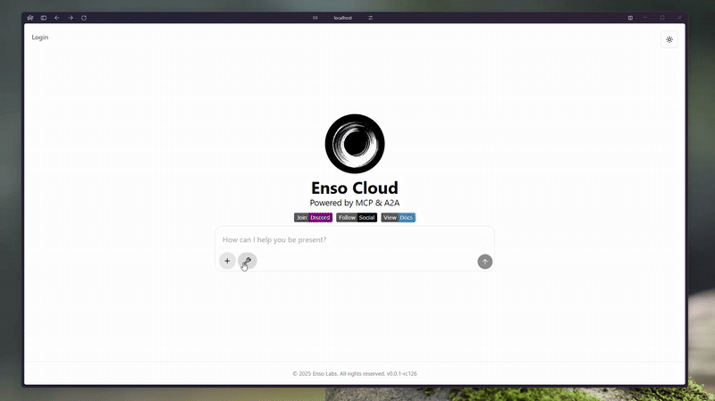

<div align="center">

# Enso Labs - Cloud ☁️ 

Composable AI Agents built on LangGraph and powered by the [MCP](https://github.com/modelcontextprotocol) & [A2A](https://github.com/google/A2A)

<a href="https://discord.com/invite/QRfjg4YNzU"></a>
<a href="https://demo.enso.sh/api"></a>
<a href="https://enso.sh/socials"></a>



</div>

Base API infrastructure for Composable AI Agents built on LangGraph and powered by the [MCP](https://github.com/modelcontextprotocol) & [A2A](https://github.com/google/A2A) protocols by [Enso Labs](https://enso.sh). The goal of Enso is the enrich the lives of the curious. Those who seek to buy back their time and compound their personal growth. Those who build and don't wait for IT to be built for them.

## 📖 Table of Contents

This project includes tools for running shell commands and Docker container operations. For detailed information, please refer to the following documentation:

- [Tools Documentation](./docs/tools/tools.md)

## 📋 Prerequisites

- [Docker](https://docs.docker.com/engine/install/ubuntu/) Installed 
- Python 3.11 or higher
- Access to OpenAI API (for GPT-4o model) or Anthropic API (for Claude 3.5 Sonnet)

## 🛠️ Development

1. **Environment Variables:**

	Create a `.env` file in the root directory and add your API key(s):

	```bash
	# Backend
	cd <project-root>/backend
	cp .example.env .env

	# Frontend
	cd <project-root>/frontend
	cp .example.env .env
	```

	Ensure that your `.env` file is not tracked by git by checking the `.gitignore`:

2. **Start Docker Services**

	Below will start the database, and the GUI for viewing the Postgres DB.

	```bash
	cd <project-root>
	docker compose up postgres pgadmin
	```

3. **Setup Server Environment**

	Assumes you're using [astral uv](https://github.com/astral-sh/uv?tab=readme-ov-file#installation). See `./backend/scripts` directory for other dev utilities.

	```bash
	# Change directory
	cd <project-root>/backend

	# Generate virtualenv
	uv venv

	# Activate
	source .venv/bin/activate

	# Install
	uv pip install -r requirements.txt -r requirements-dev.txt

	# Run
	bash scripts/dev.sh # Select "no" when prompted.
	```

4. **Setup Client Environment**

	```bash
	# Change Directory
	cd <project-root>/frontend

	# Install
	npm install

	# Run
	npm run dev
	```

## Database Migrations

This project uses Alembic for database migrations. Here's how to work with migrations:

### Initial Setup

1. Create the database (if not exists):

	```bash
	cd backend
	alembic upgrade head
	```

	```bash
	python -m seeds.user_seeder
	```

2. Create new

	```bash
	alembic revision -m "description_of_changes"
	```

	```bash
	### Appliy Next
	alembic upgrade +1

	### Speicif revision
	alembic upgrade <revis_id>

	### Appliy Down
	alembic downgrade -1

	### Appliy Down
	alembic downgrade <revis_id>

	### History
	alembic history
	```

## 🤝 Integrations

- [Configuring gcalcli](https://github.com/insanum/gcalcli/blob/HEAD/docs/api-auth.md)
- [Issues Logging into gcalcli](https://github.com/insanum/gcalcli/issues/808)

## 🗺️ Roadmap

- [ ] [Human-In-The-Loop](https://langchain-ai.github.io/langgraph/how-tos/create-react-agent-hitl/#usage)