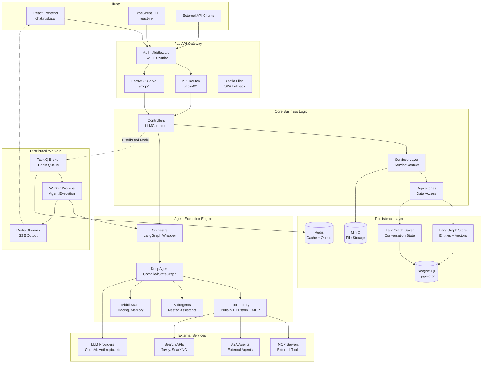
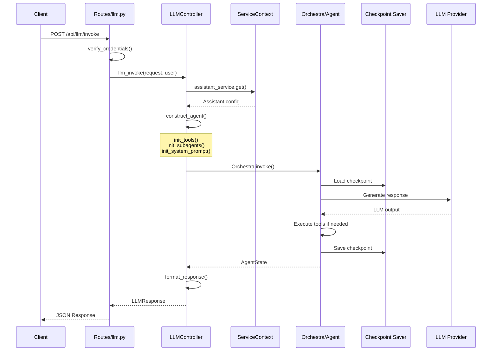
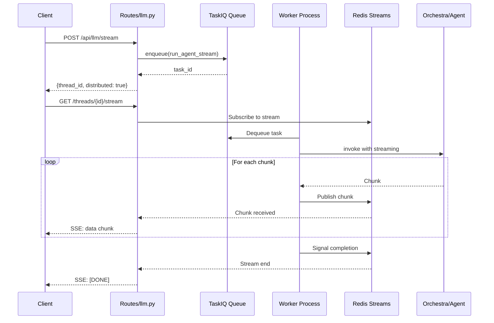
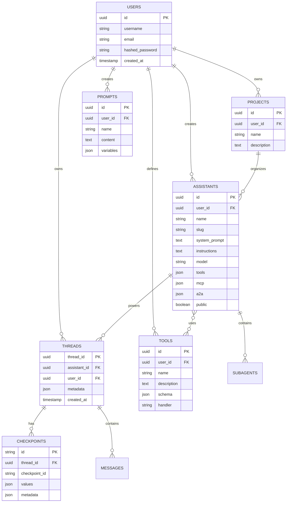
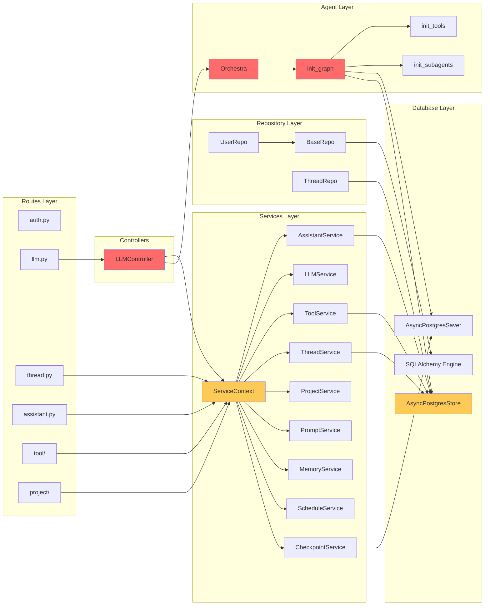
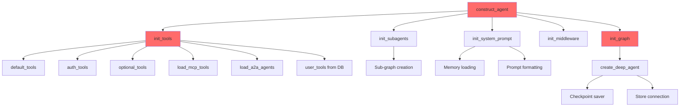
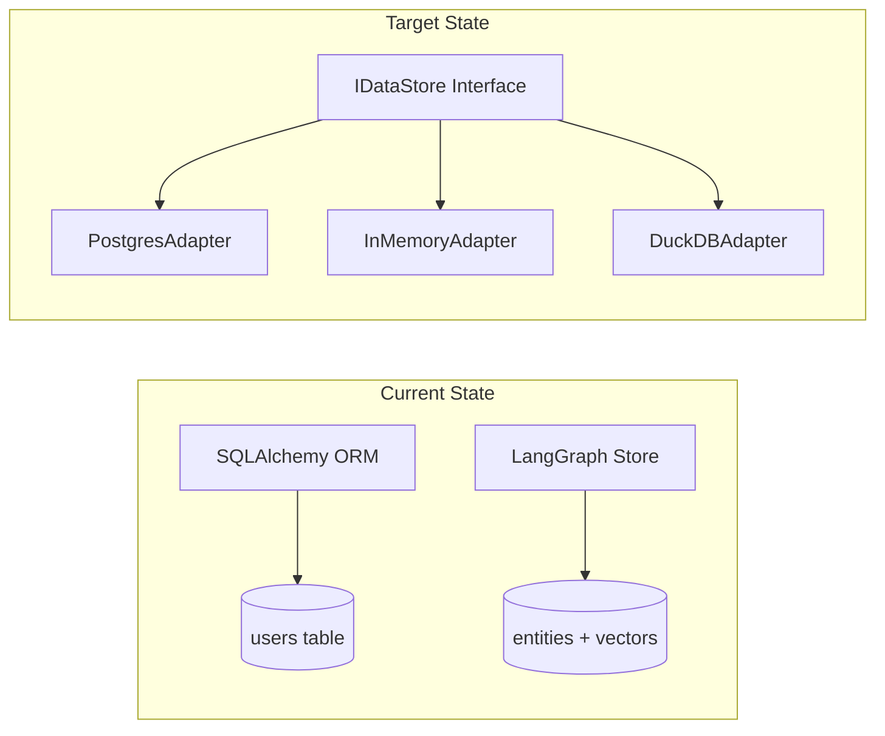
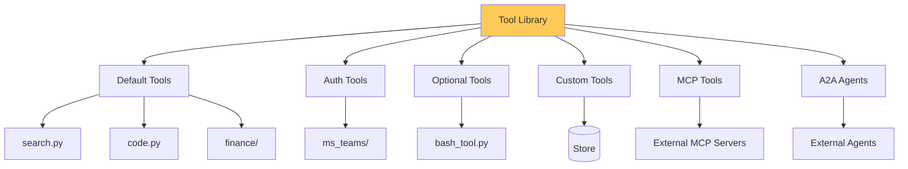

# Orchestra Architecture Analysis & Refactoring Guide

## Executive Summary

Orchestra is a full-stack AI agent orchestration platform built on LangGraph. This document maps the system architecture and identifies complexity hotspots ranked by refactoring priority.

---

## 1. High-Level Architecture



---

## 2. Request Flow Architecture

### Synchronous LLM Invoke Flow



### Streaming SSE Flow (Distributed Workers)



---

## 3. Data Architecture



---

## 4. Component Dependency Graph



**Legend:** Red = High Complexity | Yellow = Medium Complexity

---

## 5. Complexity Hotspots Ranking

### Priority Matrix

| Rank | Component | Complexity Score | Impact | Effort | Key Files |
|------|-----------|------------------|--------|--------|-----------|
| **1** | Agent Construction Pipeline | 9/10 | Critical | High | `src/agents/__init__.py`, `src/controllers/llm.py` |
| **2** | Service Dependency Injection | 8/10 | High | Medium | `src/contexts/service.py` |
| **3** | Database Store Abstraction | 8/10 | High | High | `src/services/db.py`, `src/repos/` |
| **4** | Streaming & Worker Logic | 7/10 | High | Medium | `src/utils/stream.py`, `src/workers/tasks.py` |
| **5** | Error Handling & Retry | 7/10 | Medium | Medium | `src/services/errors.py`, `src/services/checkpoint_resilient.py` |
| **6** | Tool Plugin System | 6/10 | Medium | Medium | `src/tools/` |
| **7** | API Route Organization | 5/10 | Medium | Low | `src/routes/v0/` |
| **8** | Frontend State Management | 5/10 | Medium | Low | `frontend/src/context/` |
| **9** | Testing Infrastructure | 4/10 | Medium | Low | `backend/tests/` |
| **10** | Frontend Components | 3/10 | Low | Low | `frontend/src/components/` |

---

## 6. Detailed Hotspot Analysis

### Hotspot #1: Agent Construction Pipeline (CRITICAL)

**Location:** `backend/src/agents/__init__.py:1-400`



**Problems:**
1. `construct_agent()` has 6+ responsibilities (violates SRP)
2. `init_tools()` has complex conditional logic for 6 tool sources
3. No clear separation between configuration and execution
4. Hard to test individual parts
5. Middleware initialization is opaque

**Recommended Refactoring:**

```python
# Before: Monolithic function
def construct_agent(request, assistant, config, store, saver):
    tools = init_tools(...)  # 100+ lines
    subagents = init_subagents(...)  # 50+ lines
    prompt = init_system_prompt(...)  # 30+ lines
    middleware = init_middleware(...)  # 20+ lines
    return init_graph(...)

# After: Builder pattern with composable parts
class AgentBuilder:
    def with_tools(self, tool_config: ToolConfig) -> Self
    def with_subagents(self, subagent_defs: list[Assistant]) -> Self
    def with_memory(self, memory_config: MemoryConfig) -> Self
    def with_middleware(self, middleware_chain: list[Middleware]) -> Self
    def build(self) -> Orchestra

# Usage
agent = (AgentBuilder(assistant, config)
    .with_tools(ToolConfig(user=user_tools, mcp=mcp_config))
    .with_subagents(assistant.subagents)
    .with_memory(MemoryConfig(store=store))
    .with_middleware([TracingMiddleware(), RetryMiddleware()])
    .build())
```

---

### Hotspot #2: Service Dependency Injection

**Location:** `backend/src/contexts/service.py`

**Problems:**
1. All services instantiated on every request (even if unused)
2. Circular dependency risk between services
3. No interface contracts (hard to mock)
4. Implicit initialization order

**Current State:**
```python
class ServiceContext:
    def __init__(self, user_id: str, store: AsyncPostgresStore):
        self.assistant_service = AssistantService(store, user_id)
        self.llm_service = LLMService(store, user_id)
        self.tool_service = ToolService(store, user_id)
        # ... 5 more services
```

**Recommended Refactoring:**
```python
# Lazy initialization with protocols
class ServiceContext:
    @cached_property
    def assistant_service(self) -> IAssistantService:
        return AssistantService(self._store, self._user_id)

    @cached_property
    def tool_service(self) -> IToolService:
        return ToolService(self._store, self._user_id)
```

---

### Hotspot #3: Database Store Abstraction

**Location:** `backend/src/services/db.py`, `backend/src/repos/`

**Problems:**
1. Two persistence patterns: SQLAlchemy (users) vs LangGraph Store (everything else)
2. No unified query interface
3. Hard to add new storage backends
4. Semantic search mixed with CRUD operations

**Diagram:**



---

### Hotspot #4: Streaming & Worker Logic

**Location:** `backend/src/utils/stream.py`, `backend/src/workers/tasks.py`

**Problems:**
1. Two parallel streaming paths (direct vs distributed)
2. SSE formatting mixed with business logic
3. Redis stream management scattered
4. Complex error recovery

**Recommended Refactoring:**
- Create `StreamingPipeline` abstraction
- Extract `RedisStreamManager`
- Unify direct and worker paths through common interface

---

### Hotspot #5: Tool Plugin System

**Location:** `backend/src/tools/`



**Problems:**
1. Tool registration scattered across 4+ files
2. No plugin discovery mechanism
3. Manual metadata injection
4. Hard to extend with external packages

---

## 7. Recommended Refactoring Order

```mermaid
gantt
    title Refactoring Roadmap
    dateFormat  X
    axisFormat %s

    section Phase 1: Foundation
    Agent Builder Pattern     :a1, 0, 3
    Service DI Container      :a2, 0, 2

    section Phase 2: Data Layer
    DataStore Abstraction     :b1, 3, 4
    Repository Unification    :b2, 4, 2

    section Phase 3: Runtime
    Streaming Pipeline        :c1, 6, 2
    Error Handler Middleware  :c2, 7, 2

    section Phase 4: Extensibility
    Tool Registry             :d1, 9, 2
    Plugin Discovery          :d2, 10, 2

    section Phase 5: Polish
    API Controller Layer      :e1, 11, 1
    Frontend State Refactor   :e2, 11, 2
    Test Infrastructure       :e3, 12, 1
```



---

## 8. Key File Paths Reference

### Critical Files (Start Here)

| Purpose | Path |
|---------|------|
| FastAPI Entry | `backend/main.py` |
| Agent Construction | `backend/src/agents/__init__.py` |
| LLM Controller | `backend/src/controllers/llm.py` |
| Service Context | `backend/src/contexts/service.py` |
| Database Setup | `backend/src/services/db.py` |

### Routes Layer

| Domain | Path |
|--------|------|
| Authentication | `backend/src/routes/v0/auth.py` |
| LLM Execution | `backend/src/routes/v0/llm.py` |
| Threads | `backend/src/routes/v0/thread.py` |
| Assistants | `backend/src/routes/v0/assistant.py` |
| Tools | `backend/src/routes/v0/tool/` |
| Projects | `backend/src/routes/v0/project/` |

### Services Layer

| Service | Path |
|---------|------|
| Assistant | `backend/src/services/assistant.py` |
| Thread | `backend/src/services/thread.py` |
| Tool | `backend/src/services/tool.py` |
| Checkpoint | `backend/src/services/checkpoint.py` |
| Memory | `backend/src/services/memory.py` |
| Streaming | `backend/src/utils/stream.py` |

### Tools

| Tool Category | Path |
|---------------|------|
| Search | `backend/src/tools/search.py` |
| Code Execution | `backend/src/tools/code.py` |
| Bash | `backend/src/tools/bash_tool.py` |
| Finance | `backend/src/tools/finance/` |
| MS Teams | `backend/src/tools/ms_teams/` |
| A2A Protocol | `backend/src/tools/a2a.py` |

### Frontend

| Component | Path |
|-----------|------|
| Chat Page | `frontend/src/pages/chat/` |
| Agent Context | `frontend/src/context/AgentContext.tsx` |
| Chat Context | `frontend/src/context/ChatContext.tsx` |
| API Services | `frontend/src/lib/services/` |

### Configuration

| File | Purpose |
|------|---------|
| `backend/pyproject.toml` | Python dependencies |
| `frontend/package.json` | npm dependencies |
| `docker-compose.yml` | Service orchestration |
| `backend/src/constants/__init__.py` | Environment config |

---

## 9. Metrics for Success

After refactoring, measure:

1. **Test Coverage**: Target 80%+ for critical paths
2. **Cyclomatic Complexity**: Reduce `construct_agent()` from ~15 to <5
3. **Time to Add New Tool**: Should be <30 minutes with plugin system
4. **Request Latency**: Maintain p95 < 200ms for non-LLM operations
5. **Developer Onboarding**: New contributor productive in <1 day

---

## 10. Next Steps

1. **Immediate**: Review `backend/src/agents/__init__.py` - the highest complexity area
2. **Short-term**: Design `AgentBuilder` interface and prototype
3. **Medium-term**: Implement `IDataStore` abstraction for testing
4. **Long-term**: Full plugin system with external tool packages

---

*Generated: 2026-01-25*
*Branch: claude/app-architecture-analysis-XaiKI*
