# PRD-001: Agent Construction Pipeline Refactoring

| Field | Value |
|-------|-------|
| **PRD ID** | PRD-001 |
| **Title** | Agent Construction Pipeline Refactoring |
| **Priority** | P0 (Critical) |
| **Complexity** | 9/10 |
| **Status** | Draft |
| **Author** | Architecture Team |
| **Created** | 2026-01-25 |
| **Target Files** | `backend/src/agents/__init__.py`, `backend/src/controllers/llm.py` |

---

## 1. Problem Statement

### 1.1 Current State

The agent construction pipeline in `backend/src/agents/__init__.py` is the most complex component in the Orchestra codebase. It handles all LLM agent creation and is invoked on every request, making it a critical path for system reliability and performance.

**Current Architecture:**

```
construct_agent()
├── init_subagents() → Recursively builds nested agents
│   └── init_tools() → Called for each subagent
├── init_system_prompt() → Formats prompt with instructions
└── Orchestra() → Wraps LangGraph CompiledStateGraph
    └── init_graph() → Creates the actual graph
        └── init_default_middleware() → Adds tracing, etc.
```

### 1.2 Key Problems

| # | Problem | Impact | Evidence |
|---|---------|--------|----------|
| 1 | **Monolithic `construct_agent()`** | Hard to test, modify, or extend | Single function handles 6+ responsibilities |
| 2 | **Scattered tool initialization** | Inconsistent tool loading, bugs | `init_tools()` has 5 conditional branches for different sources |
| 3 | **No separation of configuration and execution** | Can't validate config before execution | Config parsing mixed with graph construction |
| 4 | **Implicit middleware chain** | Unclear what middleware runs | `init_default_middleware()` hides middleware logic |
| 5 | **Tight coupling to LangGraph internals** | Difficult to upgrade LangGraph | Direct use of `create_deep_agent`, `CompiledStateGraph` |
| 6 | **No caching of agent configurations** | Redundant work on every request | Same assistant config rebuilt repeatedly |
| 7 | **Error handling is minimal** | Unclear failure modes | Single try/catch around entire construction |

### 1.3 Code Smells Identified

```python
# Problem 1: God function with too many parameters
async def construct_agent(
    instructions: str,
    system_prompt: str,
    model: BaseChatModel,
    tools: list[BaseTool],
    subagents: list[SubAgent] = [],
    middleware: list[Callable] = [],
    backend: CompositeBackend = None,
    checkpointer: BaseCheckpointSaver = None,
    service_context: ServiceContext = None,  # 9 parameters!
):

# Problem 2: Mixed abstraction levels in init_tools()
async def init_tools(...):
    tool_map = {t.name: t for t in default_tools()}  # Loading defaults
    tools_list = [tool_map[name] for name in (tools or []) if name in tool_map]
    a2a = A2AServers(a2a=a2a)  # Constructing A2A
    if a2a.validate() and thread_id:
        tools_list = tools_list + a2a.fetch_agent_cards_as_tools(thread_id)  # External fetch
    if mcp:
        mcp_client = MultiServerMCPClient(mcp)
        tools_list = tools_list + await mcp_client.get_tools()  # Another external fetch
    if user_id:
        # Database query mixed with tool loading
        items = await service_context.tool_service.tool_repo.search(...)
```

### 1.4 Business Impact

- **Reliability**: Complex code path increases bug surface area
- **Velocity**: Developers avoid modifying this file due to complexity
- **Extensibility**: Adding new tool sources requires touching multiple places
- **Testing**: No unit tests possible for individual components
- **Performance**: No opportunity for caching or optimization

---

## 2. Goals & Success Metrics

### 2.1 Goals

| Goal | Description |
|------|-------------|
| **G1** | Reduce cyclomatic complexity of agent construction from ~15 to <5 |
| **G2** | Enable unit testing of each component in isolation |
| **G3** | Support adding new tool sources without modifying core logic |
| **G4** | Separate configuration validation from execution |
| **G5** | Maintain 100% backward compatibility with existing API |

### 2.2 Success Metrics

| Metric | Current | Target | Measurement |
|--------|---------|--------|-------------|
| Cyclomatic complexity | ~15 | <5 | `radon cc src/agents/` |
| Test coverage | 0% | >80% | `pytest --cov` |
| Lines per function | 50-100 | <30 | LOC count |
| Time to add new tool source | ~2 hours | <30 min | Developer estimate |
| Agent construction latency | baseline | <5% increase | Benchmark tests |

### 2.3 Non-Goals

- Changing the `Orchestra` public interface
- Modifying the LangGraph/DeepAgents integration patterns
- Implementing agent caching (future PRD)
- Changing the API contract with controllers

---

## 3. Requirements

### 3.1 Functional Requirements

| ID | Requirement | Priority |
|----|-------------|----------|
| FR-1 | Agent construction must support all current tool sources (default, A2A, MCP, user-defined) | Must Have |
| FR-2 | Subagent construction must work recursively with same tool sources | Must Have |
| FR-3 | System prompt must be formatted with memories and instructions | Must Have |
| FR-4 | Middleware chain must be configurable per-agent | Must Have |
| FR-5 | Configuration must be validatable before agent construction | Should Have |
| FR-6 | Tool loading must be extensible via plugin pattern | Should Have |
| FR-7 | Agent configuration should be serializable for debugging | Nice to Have |

### 3.2 Non-Functional Requirements

| ID | Requirement | Target |
|----|-------------|--------|
| NFR-1 | No increase in agent construction latency | <5% regression |
| NFR-2 | Memory usage must not increase significantly | <10% increase |
| NFR-3 | All new code must have type hints | 100% coverage |
| NFR-4 | All public interfaces must have docstrings | 100% coverage |
| NFR-5 | Backward compatibility with existing callers | 100% |

### 3.3 Constraints

- Must use existing LangGraph/DeepAgents libraries
- Must maintain compatibility with distributed worker execution
- Cannot change database schema
- Must work with existing authentication/authorization model

---

## 4. Technical Design

### 4.1 Target Architecture

```
┌─────────────────────────────────────────────────────────────┐
│                      AgentBuilder                            │
│  (Fluent API for constructing agents)                       │
├─────────────────────────────────────────────────────────────┤
│                                                              │
│  AgentBuilder(assistant_config)                             │
│    .with_tools(ToolComposer)           ──────┐              │
│    .with_subagents(SubAgentFactory)    ──────┼──► Orchestra │
│    .with_memory(MemoryLoader)          ──────┤              │
│    .with_middleware(MiddlewareChain)   ──────┘              │
│    .with_checkpoint(saver)                                   │
│    .build()                                                  │
│                                                              │
└─────────────────────────────────────────────────────────────┘
         │              │              │              │
         ▼              ▼              ▼              ▼
┌─────────────┐ ┌─────────────┐ ┌─────────────┐ ┌─────────────┐
│ToolComposer │ │SubAgentFact.│ │MemoryLoader │ │Middleware   │
│             │ │             │ │             │ │Chain        │
├─────────────┤ ├─────────────┤ ├─────────────┤ ├─────────────┤
│.add_default │ │.create()    │ │.load()      │ │.add()       │
│.add_mcp()   │ │.from_config │ │.format()    │ │.default()   │
│.add_a2a()   │ │             │ │             │ │.build()     │
│.add_user()  │ │             │ │             │ │             │
│.build()     │ │             │ │             │ │             │
└─────────────┘ └─────────────┘ └─────────────┘ └─────────────┘
         │              │              │              │
         ▼              ▼              ▼              ▼
┌─────────────┐ ┌─────────────┐ ┌─────────────┐ ┌─────────────┐
│ToolRegistry │ │  Recursive  │ │MemoryService│ │ Middleware  │
│             │ │  Builder    │ │             │ │ Registry    │
└─────────────┘ └─────────────┘ └─────────────┘ └─────────────┘
```

### 4.2 New File Structure

```
backend/src/agents/
├── __init__.py                 # Public exports only
│   └── exports: Orchestra, AgentBuilder, construct_agent (deprecated)
│
├── builder.py                  # AgentBuilder class
│   └── class AgentBuilder:
│       - with_tools(composer: ToolComposer) -> Self
│       - with_subagents(factory: SubAgentFactory) -> Self
│       - with_memory(loader: MemoryLoader) -> Self
│       - with_middleware(chain: MiddlewareChain) -> Self
│       - with_checkpoint(saver: BaseCheckpointSaver) -> Self
│       - with_store(store: BaseStore) -> Self
│       - validate() -> ValidationResult
│       - build() -> Orchestra
│
├── orchestra.py                # Orchestra class (moved from __init__)
│   └── class Orchestra:
│       - __init__(graph: CompiledStateGraph, ...)
│       - invoke(input, config) -> BaseMessage
│       - astream(messages, config) -> AsyncGenerator
│
├── config.py                   # Configuration dataclasses
│   └── @dataclass AgentConfig:
│       - model: str
│       - tools: list[str]
│       - subagents: list[SubAgentConfig]
│       - system_prompt: str
│       - instructions: str
│       - middleware: list[str]
│
├── tools/
│   ├── __init__.py             # Tool module exports
│   ├── composer.py             # ToolComposer class
│   │   └── class ToolComposer:
│   │       - add_defaults(names: list[str]) -> Self
│   │       - add_mcp(config: dict) -> Self
│   │       - add_a2a(servers: A2AServers) -> Self
│   │       - add_user(user_id: str, store: BaseStore) -> Self
│   │       - add_custom(tools: list[BaseTool]) -> Self
│   │       - build() -> list[BaseTool]
│   │
│   ├── registry.py             # ToolRegistry singleton
│   │   └── class ToolRegistry:
│   │       - register(name: str, tool: BaseTool)
│   │       - get(name: str) -> BaseTool
│   │       - list_available() -> list[str]
│   │       - discover_plugins() -> None
│   │
│   └── loaders/
│       ├── __init__.py
│       ├── base.py             # ToolLoader protocol
│       ├── default.py          # DefaultToolLoader
│       ├── mcp.py              # MCPToolLoader
│       ├── a2a.py              # A2AToolLoader
│       └── user.py             # UserToolLoader
│
├── subagents/
│   ├── __init__.py
│   └── factory.py              # SubAgentFactory
│       └── class SubAgentFactory:
│           - create(configs: list[Assistant], context) -> list[SubAgent]
│           - _build_single(config: Assistant) -> SubAgent
│
├── memory/
│   ├── __init__.py
│   └── loader.py               # MemoryLoader
│       └── class MemoryLoader:
│           - __init__(store: BaseStore, user_id: str)
│           - load() -> list[Memory]
│           - format_for_prompt() -> str
│
├── middleware/
│   ├── __init__.py
│   ├── chain.py                # MiddlewareChain
│   │   └── class MiddlewareChain:
│   │       - add(middleware: Callable) -> Self
│   │       - default() -> Self
│   │       - build() -> list[Callable]
│   │
│   └── defaults.py             # Default middleware implementations
│       └── tracing_middleware, logging_middleware, etc.
│
├── prompts/
│   ├── __init__.py
│   └── formatter.py            # SystemPromptFormatter
│       └── class SystemPromptFormatter:
│           - __init__(template: str)
│           - with_instructions(instructions: str) -> Self
│           - with_memories(memories: str) -> Self
│           - with_context(context: dict) -> Self
│           - format() -> str
│
└── interfaces.py               # Protocol definitions
    └── protocols:
        - IToolLoader
        - ISubAgentFactory
        - IMemoryLoader
        - IMiddlewareChain
        - IAgentBuilder
```

### 4.3 Interface Definitions

```python
# backend/src/agents/interfaces.py
from typing import Protocol, Self
from langchain_core.tools import BaseTool
from langgraph.checkpoint.base import BaseCheckpointSaver
from langgraph.store.base import BaseStore

class IToolLoader(Protocol):
    """Interface for loading tools from a specific source."""

    async def load(self, context: "LoaderContext") -> list[BaseTool]:
        """Load tools from this source."""
        ...

    def supports(self, config: dict) -> bool:
        """Check if this loader can handle the given config."""
        ...


class IToolComposer(Protocol):
    """Interface for composing tools from multiple sources."""

    def add_loader(self, loader: IToolLoader) -> Self:
        """Add a tool loader to the composition."""
        ...

    async def build(self) -> list[BaseTool]:
        """Build the final list of tools."""
        ...


class IAgentBuilder(Protocol):
    """Interface for building Orchestra agents."""

    def with_tools(self, composer: IToolComposer) -> Self: ...
    def with_subagents(self, subagents: list["SubAgentConfig"]) -> Self: ...
    def with_memory(self, loader: "IMemoryLoader") -> Self: ...
    def with_middleware(self, chain: "IMiddlewareChain") -> Self: ...
    def with_checkpoint(self, saver: BaseCheckpointSaver) -> Self: ...
    def with_store(self, store: BaseStore) -> Self: ...
    def validate(self) -> "ValidationResult": ...
    async def build(self) -> "Orchestra": ...


class IMiddlewareChain(Protocol):
    """Interface for middleware chain construction."""

    def add(self, middleware: Callable) -> Self: ...
    def default(self) -> Self: ...
    def build(self) -> list[Callable]: ...
```

### 4.4 Example Usage

```python
# Before (current implementation)
agent = await construct_agent(
    instructions=assistant.instructions,
    system_prompt=assistant.system_prompt,
    model=model,
    tools=await init_tools(assistant.tools, assistant.a2a, assistant.mcp, service_context),
    subagents=assistant.subagents,
    middleware=[],
    backend=backend,
    checkpointer=checkpointer,
    service_context=service_context,
)

# After (new implementation)
agent = await (
    AgentBuilder(assistant)
    .with_tools(
        ToolComposer()
        .add_defaults(assistant.tools)
        .add_mcp(assistant.mcp)
        .add_a2a(assistant.a2a)
        .add_user(user_id, store)
    )
    .with_subagents(assistant.subagents)
    .with_memory(MemoryLoader(store, user_id))
    .with_middleware(MiddlewareChain.default())
    .with_checkpoint(checkpointer)
    .with_store(store)
    .build()
)

# Backward compatibility wrapper (deprecated)
async def construct_agent(...):
    """Deprecated: Use AgentBuilder instead."""
    warnings.warn("construct_agent is deprecated, use AgentBuilder", DeprecationWarning)
    return await AgentBuilder(assistant).with_tools(...).build()
```

### 4.5 Migration Strategy

```mermaid
gantt
    title Migration Timeline
    dateFormat  X
    axisFormat %s

    section Phase 1
    Create interfaces & protocols     :a1, 0, 1
    Implement ToolComposer           :a2, 1, 2
    Implement ToolRegistry           :a3, 1, 2

    section Phase 2
    Implement AgentBuilder           :b1, 3, 2
    Implement SubAgentFactory        :b2, 3, 2
    Implement MiddlewareChain        :b3, 3, 2

    section Phase 3
    Add backward compat wrapper      :c1, 5, 1
    Migrate controllers              :c2, 6, 1
    Remove old code                  :c3, 7, 1

    section Phase 4
    Add comprehensive tests          :d1, 5, 3
    Update documentation             :d2, 7, 1
```



**Phase 1: Foundation (Week 1)**
1. Create `interfaces.py` with all Protocol definitions
2. Implement `ToolRegistry` as singleton with default tools
3. Implement `ToolComposer` with loader pattern
4. Write unit tests for tool loading

**Phase 2: Builder Pattern (Week 2)**
1. Implement `AgentBuilder` class
2. Implement `SubAgentFactory` (recursive builder usage)
3. Implement `MiddlewareChain`
4. Implement `MemoryLoader` and `SystemPromptFormatter`

**Phase 3: Migration (Week 3)**
1. Add deprecation warning to old `construct_agent()`
2. Create backward-compatible wrapper using new builder
3. Migrate `LLMController` to use `AgentBuilder`
4. Migrate worker tasks to use `AgentBuilder`

**Phase 4: Cleanup (Week 4)**
1. Add integration tests
2. Update architecture documentation
3. Remove deprecated code (after validation)

---

## 5. Risks & Mitigations

| Risk | Likelihood | Impact | Mitigation |
|------|------------|--------|------------|
| Breaking existing agent behavior | Medium | High | Extensive integration tests, feature flags |
| Performance regression | Low | Medium | Benchmark before/after, lazy loading |
| Increased complexity initially | Medium | Low | Clear documentation, code reviews |
| Circular imports | Medium | Medium | Strict layering, interface segregation |
| Backward compatibility issues | Low | High | Deprecation wrapper, gradual migration |

---

## 6. Acceptance Criteria

### 6.1 Functional Acceptance

- [ ] `AgentBuilder` can construct agents with all current tool sources
- [ ] `ToolComposer` supports default, MCP, A2A, and user-defined tools
- [ ] `SubAgentFactory` correctly builds recursive subagent trees
- [ ] `MiddlewareChain` applies middleware in correct order
- [ ] All existing controller tests pass without modification
- [ ] Distributed worker execution works unchanged

### 6.2 Quality Acceptance

- [ ] Unit test coverage >80% for new code
- [ ] All public interfaces have docstrings
- [ ] No increase in cyclomatic complexity of calling code
- [ ] Type hints on all functions
- [ ] `make format` passes
- [ ] `mypy src/agents/` passes with no errors

### 6.3 Performance Acceptance

- [ ] Agent construction latency <5% regression
- [ ] Memory usage <10% increase
- [ ] No new database queries added to hot path

---

## 7. Open Questions

| # | Question | Status | Answer |
|---|----------|--------|--------|
| 1 | Should we cache `AgentBuilder` configurations? | Open | Consider for future PRD |
| 2 | Should `ToolRegistry` support hot-reload? | Open | Nice to have, not required |
| 3 | How to handle tool conflicts (same name from multiple sources)? | Open | Last-write-wins with warning log |
| 4 | Should we expose `AgentBuilder` in public API? | Open | Yes, for advanced use cases |

---

## 8. Appendix

### A. Current Code Analysis

**File: `backend/src/agents/__init__.py`**
- Lines: 294
- Functions: 9
- Classes: 1 (Orchestra)
- Cyclomatic complexity: ~15 (construct_agent + init_tools)

**Key Dependencies:**
- `langchain_core`: BaseChatModel, BaseTool, BaseMessage
- `langgraph`: CompiledStateGraph, BaseCheckpointSaver, BaseStore
- `deepagents`: SubAgent, create_deep_agent, CompositeBackend
- `langchain_mcp_adapters`: MultiServerMCPClient

### B. Related PRDs

- PRD-002: Service Dependency Injection (depends on this)
- PRD-003: Database Store Abstraction (independent)
- PRD-006: Tool Plugin System (builds on this)

---

*Document Version: 1.0*
*Last Updated: 2026-01-25*
