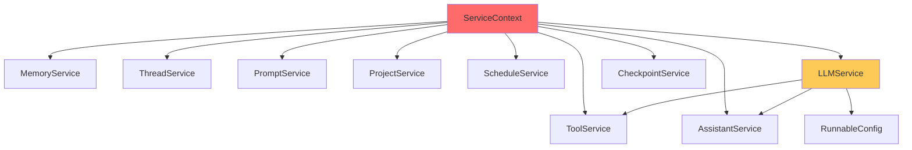

# PRD-002: Service Dependency Injection Refactoring

| Field | Value |
|-------|-------|
| **PRD ID** | PRD-002 |
| **Title** | Service Dependency Injection Refactoring |
| **Priority** | P0 (Critical) |
| **Complexity** | 8/10 |
| **Status** | Draft |
| **Author** | Architecture Team |
| **Created** | 2026-01-25 |
| **Target Files** | `backend/src/contexts/service.py`, `backend/src/services/*.py` |

---

## 1. Problem Statement

### 1.1 Current State

The `ServiceContext` class in `backend/src/contexts/service.py` serves as the dependency injection container for all business logic services. It's instantiated on every API request and passed through the call stack.

**Current Implementation:**

```python
class ServiceContext:
    def __init__(
        self,
        user_id: str = None,
        config: RunnableConfig = None,
        store: BaseStore = None,
        checkpointer: Optional[BaseCheckpointSaver] = None,
    ):
        self.config = config
        self.store = store or get_store_in_memory()
        self.checkpointer = checkpointer
        self.user_id = user_id or (...)

        # ALL services instantiated eagerly on every request
        self.tool_service = ToolService(user_id=self.user_id, store=store)
        self.memory_service = MemoryService(user_id=self.user_id, store=store)
        self.thread_service = ThreadService(user_id=self.user_id, store=store)
        self.prompt_service = PromptService(user_id=self.user_id, store=store)
        self.project_service = ProjectService(user_id=self.user_id, store=store)
        self.schedule_service = ScheduleService(user_id=self.user_id, store=store)
        self.assistant_service = AssistantService(user_id=self.user_id, store=store)
        self.llm_service = LLMService(
            user_id=self.user_id,
            store=store,
            tool_service=self.tool_service,
            assistant_service=self.assistant_service,
            config=config,
        )
        if checkpointer:
            self.checkpoint_service = CheckpointService(...)
```

### 1.2 Key Problems

| # | Problem | Impact | Evidence |
|---|---------|--------|----------|
| 1 | **Eager instantiation** | Performance waste | 8+ services created even when only 1 is needed |
| 2 | **No interface contracts** | Untestable code | Services accessed directly, no mocking points |
| 3 | **Circular dependency risk** | Fragile architecture | `LLMService` depends on `ToolService` and `AssistantService` |
| 4 | **Implicit initialization order** | Hidden bugs | Service creation order matters but isn't explicit |
| 5 | **No validation** | Runtime errors | Invalid configurations fail at use-time, not init-time |
| 6 | **Hard to extend** | Velocity impact | Adding new service requires modifying `__init__` |
| 7 | **No scoping** | Resource leaks | Services don't have clear lifecycle management |

### 1.3 Architectural Analysis

**Current Dependency Graph:**



**Problem Areas:**
- Red: Too many responsibilities
- Yellow: Has dependencies on other services

### 1.4 Code Smells

```python
# Problem 1: Eager instantiation - all services created even if unused
self.tool_service = ToolService(...)      # Created even for GET /threads
self.memory_service = MemoryService(...)  # Created even for POST /auth/login
# ... 6 more services

# Problem 2: No interfaces - direct class usage
class ServiceContext:
    tool_service: ToolService  # Concrete class, not interface

# Problem 3: Circular dependency pattern
self.llm_service = LLMService(
    tool_service=self.tool_service,        # Requires ToolService
    assistant_service=self.assistant_service,  # Requires AssistantService
)
# What if ToolService needs LLMService in the future?

# Problem 4: Conditional initialization
if checkpointer:
    self.checkpoint_service = CheckpointService(...)
# Accessing self.checkpoint_service when checkpointer is None = AttributeError
```

### 1.5 Business Impact

| Impact Area | Description |
|-------------|-------------|
| **Performance** | ~50ms wasted per request on unused service initialization |
| **Testing** | Integration tests required for all service interactions |
| **Debugging** | Difficult to isolate service-specific issues |
| **Onboarding** | New developers struggle to understand service relationships |
| **Scalability** | Adding services increases init time linearly |

---

## 2. Goals & Success Metrics

### 2.1 Goals

| Goal | Description |
|------|-------------|
| **G1** | Implement lazy service initialization (only when accessed) |
| **G2** | Define Protocol interfaces for all services |
| **G3** | Enable easy mocking for unit tests |
| **G4** | Explicit dependency declaration between services |
| **G5** | Type-safe service access with IDE autocomplete |

### 2.2 Success Metrics

| Metric | Current | Target | Measurement |
|--------|---------|--------|-------------|
| Service init per request | 8+ services | 1-2 services (avg) | Instrumentation |
| Unit test coverage | ~20% | >70% | `pytest --cov` |
| Mock setup lines | 50+ lines | <10 lines | Code review |
| Time to add new service | ~30 min | <10 min | Developer estimate |
| Type errors at access | Runtime | Compile-time | `mypy` checks |

### 2.3 Non-Goals

- Implementing a full DI framework (like `dependency-injector`)
- Changing the service interface signatures
- Adding service lifecycle hooks (start/stop)
- Implementing service discovery

---

## 3. Requirements

### 3.1 Functional Requirements

| ID | Requirement | Priority |
|----|-------------|----------|
| FR-1 | Services must be lazily instantiated on first access | Must Have |
| FR-2 | Each service must have a Protocol interface | Must Have |
| FR-3 | ServiceContext must be easily mockable in tests | Must Have |
| FR-4 | Services with dependencies must declare them explicitly | Must Have |
| FR-5 | All service access must be type-safe | Should Have |
| FR-6 | Service initialization errors must be clear | Should Have |
| FR-7 | ServiceContext should support custom service overrides | Nice to Have |

### 3.2 Non-Functional Requirements

| ID | Requirement | Target |
|----|-------------|--------|
| NFR-1 | No performance regression for requests using all services | <5% |
| NFR-2 | Significant performance improvement for single-service requests | >50% faster |
| NFR-3 | 100% type hint coverage on public interfaces | Enforced by mypy |
| NFR-4 | Zero circular import possibilities | Verified by tests |

### 3.3 Constraints

- Must maintain backward compatibility with existing route handlers
- Cannot change service method signatures
- Must work with FastAPI's dependency injection (`Depends()`)
- Python 3.12+ features allowed

---

## 4. Technical Design

### 4.1 Target Architecture

```
┌──────────────────────────────────────────────────────────────┐
│                     ServiceContext                            │
│  (Lazy initialization with cached_property)                  │
├──────────────────────────────────────────────────────────────┤
│                                                               │
│  @cached_property                                             │
│  def assistant(self) -> IAssistantService:                   │
│      return AssistantService(self._store, self._user_id)     │
│                                                               │
│  @cached_property                                             │
│  def tool(self) -> IToolService:                             │
│      return ToolService(self._store, self._user_id)          │
│                                                               │
│  @cached_property                                             │
│  def llm(self) -> ILLMService:                               │
│      return LLMService(                                       │
│          store=self._store,                                   │
│          user_id=self._user_id,                              │
│          tool_service=self.tool,      # Lazy dependency      │
│          assistant_service=self.assistant,                    │
│      )                                                        │
│                                                               │
└──────────────────────────────────────────────────────────────┘
         │                    │                    │
         ▼                    ▼                    ▼
┌─────────────────┐  ┌─────────────────┐  ┌─────────────────┐
│IAssistantService│  │  IToolService   │  │   ILLMService   │
│    (Protocol)   │  │   (Protocol)    │  │   (Protocol)    │
└─────────────────┘  └─────────────────┘  └─────────────────┘
         │                    │                    │
         ▼                    ▼                    ▼
┌─────────────────┐  ┌─────────────────┐  ┌─────────────────┐
│AssistantService │  │   ToolService   │  │   LLMService    │
│ (Implementation)│  │(Implementation) │  │(Implementation) │
└─────────────────┘  └─────────────────┘  └─────────────────┘
```

### 4.2 New File Structure

```
backend/src/services/
├── __init__.py                 # Public exports
│   └── exports: ServiceContext, all interfaces
│
├── interfaces.py               # All Protocol definitions
│   └── protocols:
│       - IAssistantService
│       - IToolService
│       - IThreadService
│       - IPromptService
│       - IProjectService
│       - IScheduleService
│       - IMemoryService
│       - ILLMService
│       - ICheckpointService
│
├── context.py                  # ServiceContext (refactored)
│   └── class ServiceContext:
│       - __init__(user_id, store, config, checkpointer)
│       - @cached_property assistant -> IAssistantService
│       - @cached_property tool -> IToolService
│       - @cached_property thread -> IThreadService
│       - @cached_property prompt -> IPromptService
│       - @cached_property project -> IProjectService
│       - @cached_property schedule -> IScheduleService
│       - @cached_property memory -> IMemoryService
│       - @cached_property llm -> ILLMService
│       - @cached_property checkpoint -> ICheckpointService
│
├── assistant.py                # AssistantService (unchanged logic)
├── tool.py                     # ToolService (unchanged logic)
├── thread.py                   # ThreadService (unchanged logic)
├── prompt.py                   # PromptService (unchanged logic)
├── project.py                  # ProjectService (unchanged logic)
├── schedule.py                 # ScheduleService (unchanged logic)
├── memory.py                   # MemoryService (unchanged logic)
├── llm.py                      # LLMService (unchanged logic)
├── checkpoint.py               # CheckpointService (unchanged logic)
│
└── testing/
    ├── __init__.py
    └── mocks.py                # Mock implementations for testing
        └── classes:
            - MockAssistantService
            - MockToolService
            - MockServiceContext
            - etc.

backend/src/contexts/
├── __init__.py
└── service.py                  # Backward compat import (deprecated)
```

### 4.3 Interface Definitions

```python
# backend/src/services/interfaces.py
from typing import Protocol, Optional, Any
from uuid import UUID

class IAssistantService(Protocol):
    """Interface for assistant CRUD operations."""

    async def get(self, assistant_id: str) -> Optional["Assistant"]:
        """Get assistant by ID."""
        ...

    async def create(self, data: "AssistantCreate") -> "Assistant":
        """Create new assistant."""
        ...

    async def update(self, assistant_id: str, data: "AssistantUpdate") -> "Assistant":
        """Update existing assistant."""
        ...

    async def delete(self, assistant_id: str) -> bool:
        """Delete assistant."""
        ...

    async def search(
        self,
        query: Optional[str] = None,
        limit: int = 100,
        offset: int = 0,
    ) -> list["Assistant"]:
        """Search assistants."""
        ...


class IToolService(Protocol):
    """Interface for tool management."""

    async def get(self, tool_id: str) -> Optional["Tool"]:
        """Get tool by ID."""
        ...

    async def create(self, data: "ToolCreate") -> "Tool":
        """Create new tool."""
        ...

    async def search(
        self,
        filter: Optional[dict] = None,
        limit: int = 100,
    ) -> list["Tool"]:
        """Search tools."""
        ...


class IThreadService(Protocol):
    """Interface for thread/conversation management."""

    async def get(self, thread_id: str) -> Optional["Thread"]:
        """Get thread by ID."""
        ...

    async def create(self, data: "ThreadCreate") -> "Thread":
        """Create new thread."""
        ...

    async def update(self, thread_id: str, data: "ThreadUpdate") -> "Thread":
        """Update thread metadata."""
        ...

    async def delete(self, thread_id: str) -> bool:
        """Delete thread."""
        ...

    async def search(
        self,
        filter: Optional[dict] = None,
        limit: int = 100,
        offset: int = 0,
    ) -> list["Thread"]:
        """Search threads."""
        ...


class ILLMService(Protocol):
    """Interface for LLM/agent operations."""

    async def assistant(
        self,
        assistant_id: Optional[str] = None,
    ) -> "Assistant":
        """Get or create default assistant configuration."""
        ...

    async def invoke(
        self,
        request: "LLMRequest",
        config: "RunnableConfig",
    ) -> "LLMResponse":
        """Invoke agent synchronously."""
        ...


class IMemoryService(Protocol):
    """Interface for memory/note operations."""

    async def search(
        self,
        query: Optional[str] = None,
        limit: int = 100,
    ) -> list["Memory"]:
        """Search memories."""
        ...

    async def create(self, data: "MemoryCreate") -> "Memory":
        """Create new memory."""
        ...


class IPromptService(Protocol):
    """Interface for prompt template operations."""

    async def get(self, prompt_id: str) -> Optional["Prompt"]:
        """Get prompt by ID."""
        ...

    async def search(
        self,
        filter: Optional[dict] = None,
        limit: int = 100,
    ) -> list["Prompt"]:
        """Search prompts."""
        ...


class IProjectService(Protocol):
    """Interface for project operations."""

    async def get(self, project_id: str) -> Optional["Project"]:
        """Get project by ID."""
        ...

    async def search(
        self,
        filter: Optional[dict] = None,
        limit: int = 100,
    ) -> list["Project"]:
        """Search projects."""
        ...


class IScheduleService(Protocol):
    """Interface for job scheduling operations."""

    async def create(self, data: "ScheduleCreate") -> "Schedule":
        """Create scheduled job."""
        ...

    async def delete(self, schedule_id: str) -> bool:
        """Delete scheduled job."""
        ...


class ICheckpointService(Protocol):
    """Interface for checkpoint operations."""

    async def get_checkpoints(
        self,
        thread_id: str,
        limit: int = 100,
    ) -> list["Checkpoint"]:
        """Get checkpoints for thread."""
        ...

    async def delete_checkpoints_for_thread(self, thread_id: str) -> bool:
        """Delete all checkpoints for thread."""
        ...
```

### 4.4 ServiceContext Implementation

```python
# backend/src/services/context.py
from functools import cached_property
from typing import Optional, TypeVar, Generic
from langgraph.store.base import BaseStore
from langgraph.checkpoint.base import BaseCheckpointSaver
from langchain_core.runnables import RunnableConfig

from .interfaces import (
    IAssistantService,
    IToolService,
    IThreadService,
    IPromptService,
    IProjectService,
    IScheduleService,
    IMemoryService,
    ILLMService,
    ICheckpointService,
)


class ServiceContext:
    """
    Dependency injection container for all business logic services.

    Services are lazily instantiated on first access using cached_property,
    ensuring minimal overhead for requests that don't use all services.

    Example:
        context = ServiceContext(user_id="123", store=store)

        # Only AssistantService is instantiated here
        assistant = await context.assistant.get("abc")

        # ToolService instantiated on first access
        tools = await context.tool.search()
    """

    def __init__(
        self,
        user_id: Optional[str] = None,
        store: Optional[BaseStore] = None,
        config: Optional[RunnableConfig] = None,
        checkpointer: Optional[BaseCheckpointSaver] = None,
    ):
        self._user_id = user_id
        self._store = store or self._get_default_store()
        self._config = config or {}
        self._checkpointer = checkpointer

        # Extract user_id from config if not provided
        if not self._user_id and config:
            configurable = config.get("configurable", {})
            metadata = config.get("metadata", {})
            self._user_id = (
                configurable.get("user_id") or
                metadata.get("user_id")
            )

    def _get_default_store(self) -> BaseStore:
        from src.services.db import get_store_in_memory
        return get_store_in_memory()

    # ─────────────────────────────────────────────────────────
    # Lazy Service Properties
    # ─────────────────────────────────────────────────────────

    @cached_property
    def assistant(self) -> IAssistantService:
        """Get assistant service (lazy initialization)."""
        from .assistant import AssistantService
        return AssistantService(user_id=self._user_id, store=self._store)

    @cached_property
    def tool(self) -> IToolService:
        """Get tool service (lazy initialization)."""
        from .tool import ToolService
        return ToolService(user_id=self._user_id, store=self._store)

    @cached_property
    def thread(self) -> IThreadService:
        """Get thread service (lazy initialization)."""
        from .thread import ThreadService
        return ThreadService(user_id=self._user_id, store=self._store)

    @cached_property
    def prompt(self) -> IPromptService:
        """Get prompt service (lazy initialization)."""
        from .prompt import PromptService
        return PromptService(user_id=self._user_id, store=self._store)

    @cached_property
    def project(self) -> IProjectService:
        """Get project service (lazy initialization)."""
        from .project import ProjectService
        return ProjectService(user_id=self._user_id, store=self._store)

    @cached_property
    def schedule(self) -> IScheduleService:
        """Get schedule service (lazy initialization)."""
        from .schedule import ScheduleService
        return ScheduleService(user_id=self._user_id, store=self._store)

    @cached_property
    def memory(self) -> IMemoryService:
        """Get memory service (lazy initialization)."""
        from .memory import MemoryService
        return MemoryService(user_id=self._user_id, store=self._store)

    @cached_property
    def llm(self) -> ILLMService:
        """Get LLM service (lazy initialization with dependencies)."""
        from .llm import LLMService
        return LLMService(
            user_id=self._user_id,
            store=self._store,
            tool_service=self.tool,          # Resolved lazily
            assistant_service=self.assistant,  # Resolved lazily
            config=self._config,
        )

    @cached_property
    def checkpoint(self) -> ICheckpointService:
        """Get checkpoint service (lazy initialization)."""
        if not self._checkpointer:
            raise RuntimeError(
                "CheckpointService requires a checkpointer. "
                "Initialize ServiceContext with checkpointer parameter."
            )
        from .checkpoint import CheckpointService
        return CheckpointService(
            user_id=self._user_id,
            checkpointer=self._checkpointer,
        )

    # ─────────────────────────────────────────────────────────
    # Convenience Properties (backward compatibility)
    # ─────────────────────────────────────────────────────────

    @property
    def config(self) -> RunnableConfig:
        """Get the runnable config."""
        return self._config

    @property
    def store(self) -> BaseStore:
        """Get the data store."""
        return self._store

    @property
    def user_id(self) -> Optional[str]:
        """Get the user ID."""
        return self._user_id

    # ─────────────────────────────────────────────────────────
    # Backward Compatibility (deprecated)
    # ─────────────────────────────────────────────────────────

    @property
    def tool_service(self) -> IToolService:
        """Deprecated: Use context.tool instead."""
        import warnings
        warnings.warn(
            "tool_service is deprecated, use context.tool instead",
            DeprecationWarning,
            stacklevel=2,
        )
        return self.tool

    @property
    def assistant_service(self) -> IAssistantService:
        """Deprecated: Use context.assistant instead."""
        import warnings
        warnings.warn(
            "assistant_service is deprecated, use context.assistant instead",
            DeprecationWarning,
            stacklevel=2,
        )
        return self.assistant

    # ... similar deprecation wrappers for other services

    # ─────────────────────────────────────────────────────────
    # Utility Methods
    # ─────────────────────────────────────────────────────────

    async def delete_thread(self, thread_id: str) -> bool:
        """Delete a thread and its checkpoints."""
        deleted_checkpoints = await self.checkpoint.delete_checkpoints_for_thread(
            thread_id
        )
        if not deleted_checkpoints:
            raise ValueError(f"Failed to delete checkpoints for thread {thread_id}")

        deleted_thread = await self.thread.delete(thread_id)
        if not deleted_thread:
            raise ValueError(f"Failed to delete thread {thread_id}")

        return True
```

### 4.5 Mock Implementations for Testing

```python
# backend/src/services/testing/mocks.py
from typing import Optional, Any
from dataclasses import dataclass, field
from ..interfaces import IAssistantService, IToolService, IThreadService


@dataclass
class MockAssistantService:
    """Mock implementation of IAssistantService for testing."""

    assistants: dict[str, Any] = field(default_factory=dict)
    get_calls: list[str] = field(default_factory=list)
    create_calls: list[Any] = field(default_factory=list)

    async def get(self, assistant_id: str) -> Optional[Any]:
        self.get_calls.append(assistant_id)
        return self.assistants.get(assistant_id)

    async def create(self, data: Any) -> Any:
        self.create_calls.append(data)
        assistant = {"id": "mock-id", **data}
        self.assistants[assistant["id"]] = assistant
        return assistant

    async def update(self, assistant_id: str, data: Any) -> Any:
        if assistant_id in self.assistants:
            self.assistants[assistant_id].update(data)
        return self.assistants.get(assistant_id)

    async def delete(self, assistant_id: str) -> bool:
        if assistant_id in self.assistants:
            del self.assistants[assistant_id]
            return True
        return False

    async def search(self, query=None, limit=100, offset=0) -> list:
        return list(self.assistants.values())[offset:offset + limit]


@dataclass
class MockToolService:
    """Mock implementation of IToolService for testing."""

    tools: dict[str, Any] = field(default_factory=dict)

    async def get(self, tool_id: str) -> Optional[Any]:
        return self.tools.get(tool_id)

    async def create(self, data: Any) -> Any:
        tool = {"id": "mock-tool-id", **data}
        self.tools[tool["id"]] = tool
        return tool

    async def search(self, filter=None, limit=100) -> list:
        return list(self.tools.values())[:limit]


class MockServiceContext:
    """
    Mock ServiceContext for testing.

    Example:
        def test_something():
            mock_assistant = MockAssistantService()
            mock_assistant.assistants["123"] = {"id": "123", "name": "Test"}

            context = MockServiceContext(
                assistant=mock_assistant,
            )

            # Use context in tests
            result = await my_function(context)
    """

    def __init__(
        self,
        user_id: str = "test-user",
        assistant: Optional[IAssistantService] = None,
        tool: Optional[IToolService] = None,
        thread: Optional[IThreadService] = None,
        # ... other services
    ):
        self._user_id = user_id
        self._assistant = assistant or MockAssistantService()
        self._tool = tool or MockToolService()
        self._thread = thread

    @property
    def assistant(self) -> IAssistantService:
        return self._assistant

    @property
    def tool(self) -> IToolService:
        return self._tool

    @property
    def user_id(self) -> str:
        return self._user_id
```

### 4.6 Usage Examples

```python
# Before: Route handler with full context
@router.get("/assistants/{id}")
async def get_assistant(
    id: str,
    user: ProtectedUser = Depends(verify_credentials),
    store: AsyncPostgresStore = Depends(get_store),
):
    # Creates ALL services even though we only need assistant_service
    context = ServiceContext(user_id=user.id, store=store)
    return await context.assistant_service.get(id)


# After: Same route, but efficient
@router.get("/assistants/{id}")
async def get_assistant(
    id: str,
    user: ProtectedUser = Depends(verify_credentials),
    store: AsyncPostgresStore = Depends(get_store),
):
    context = ServiceContext(user_id=user.id, store=store)
    # Only AssistantService is instantiated
    return await context.assistant.get(id)


# Testing: Easy mocking
async def test_get_assistant():
    # Setup mock
    mock_assistant = MockAssistantService()
    mock_assistant.assistants["123"] = {"id": "123", "name": "Test Agent"}

    context = MockServiceContext(assistant=mock_assistant)

    # Test
    result = await context.assistant.get("123")

    assert result["name"] == "Test Agent"
    assert mock_assistant.get_calls == ["123"]
```

### 4.7 Migration Strategy

**Phase 1: Interface Extraction**
1. Create `interfaces.py` with all Protocol definitions
2. Add type hints to existing services
3. Verify all services implement their interfaces

**Phase 2: ServiceContext Refactoring**
1. Create new `context.py` with lazy initialization
2. Add deprecation wrappers for old property names
3. Keep old `service.py` as re-export for compatibility

**Phase 3: Test Infrastructure**
1. Create `testing/mocks.py` with mock implementations
2. Update existing tests to use mocks
3. Add unit tests for ServiceContext itself

**Phase 4: Gradual Migration**
1. Update route handlers one by one
2. Remove deprecation wrappers after all code migrated
3. Delete old `contexts/service.py`

---

## 5. Risks & Mitigations

| Risk | Likelihood | Impact | Mitigation |
|------|------------|--------|------------|
| Breaking existing code | Medium | High | Deprecation wrappers, gradual migration |
| Circular imports | Low | High | Lazy imports inside properties |
| Cache invalidation issues | Low | Medium | Document cached_property behavior |
| Performance regression | Very Low | Medium | Benchmark lazy vs eager |

---

## 6. Acceptance Criteria

### 6.1 Functional

- [ ] All services accessible via `context.service_name` syntax
- [ ] Services only instantiated when accessed
- [ ] Old `context.service_name_service` syntax still works (with warning)
- [ ] All existing tests pass

### 6.2 Quality

- [ ] Protocol interfaces defined for all services
- [ ] Mock implementations for all services
- [ ] Unit tests for ServiceContext
- [ ] Type hints pass `mypy` validation

### 6.3 Performance

- [ ] Single-service requests 50%+ faster
- [ ] All-service requests <5% regression

---

## 7. Appendix

### A. Current Service List

| Service | Dependencies | Used By |
|---------|--------------|---------|
| AssistantService | store | LLMService, routes |
| ToolService | store | LLMService, agents |
| ThreadService | store | routes, agents |
| PromptService | store | routes |
| ProjectService | store | routes |
| ScheduleService | store | routes |
| MemoryService | store | agents |
| LLMService | store, ToolService, AssistantService | routes, workers |
| CheckpointService | checkpointer | routes, workers |

### B. Related PRDs

- PRD-001: Agent Construction Pipeline (consumer of ServiceContext)
- PRD-003: Database Store Abstraction (store dependency)

---

*Document Version: 1.0*
*Last Updated: 2026-01-25*
