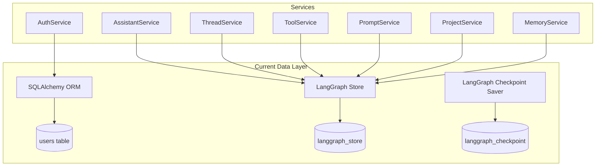

# PRD-003: Database Store Abstraction

| Field | Value |
|-------|-------|
| **PRD ID** | PRD-003 |
| **Title** | Database Store Abstraction |
| **Priority** | P1 (High) |
| **Complexity** | 8/10 |
| **Status** | Draft |
| **Author** | Architecture Team |
| **Created** | 2026-01-25 |
| **Target Files** | `backend/src/services/db.py`, `backend/src/repos/*.py` |

---

## 1. Problem Statement

### 1.1 Current State

Orchestra uses two parallel persistence mechanisms that create architectural friction:

1. **SQLAlchemy ORM** - Used only for the `users` table
2. **LangGraph Store** - Used for all other entities (assistants, threads, tools, prompts, projects, memories)

**Current Architecture:**



**Current Implementation (`db.py`):**

```python
# Two separate connection systems
# 1. SQLAlchemy for users
async_engine = create_async_engine(ASYNC_DB_URI, ...)
AsyncSessionLocal = async_sessionmaker(...)

# 2. LangGraph Store for everything else
def get_store_db(...) -> AsyncPostgresStore:
    return AsyncPostgresStore.from_conn_string(...)

# 3. LangGraph Checkpoint Saver for conversation state
async def get_checkpoint_db() -> AsyncPostgresSaver:
    async with await AsyncConnection.connect(...) as conn:
        yield AsyncPostgresSaver(conn)
```

### 1.2 Key Problems

| # | Problem | Impact | Evidence |
|---|---------|--------|----------|
| 1 | **Two persistence patterns** | Cognitive load, inconsistency | SQLAlchemy vs LangGraph Store APIs |
| 2 | **No unified query interface** | Duplicate logic | CRUD vs `aget/aput/asearch` |
| 3 | **Hard to swap backends** | Vendor lock-in | PostgreSQL deeply coupled |
| 4 | **Mixed concerns in repositories** | Unclear boundaries | Semantic search mixed with CRUD |
| 5 | **No in-memory option for testing** | Slow tests | All tests hit PostgreSQL |
| 6 | **Connection management scattered** | Resource leaks | Multiple connection patterns |
| 7 | **Hard to add new storage backends** | Limited deployment options | No SQLite for local dev |

### 1.3 Architectural Analysis

**LangGraph Store API:**
```python
# Current usage pattern
await store.aput(
    namespace=("assistants", user_id),
    key=assistant_id,
    value=assistant.model_dump(),
)

item = await store.aget(
    namespace=("assistants", user_id),
    key=assistant_id,
)

results = await store.asearch(
    namespace=("assistants", user_id),
    filter={"public": True},
    limit=100,
)

# Semantic search (vector)
results = await store.asearch(
    namespace=("assistants", user_id),
    query="customer support agent",  # Semantic query
    limit=10,
)
```

**SQLAlchemy API:**
```python
# Different pattern for users
async with AsyncSessionLocal() as session:
    result = await session.execute(
        select(User).where(User.id == user_id)
    )
    user = result.scalar_one_or_none()
```

### 1.4 Code Smells

```python
# Problem 1: Repository mixing LangGraph-specific APIs
class AssistantRepository:
    async def get(self, assistant_id: str) -> Assistant:
        # Directly using LangGraph Store API
        item = await self.store.aget(
            namespace=self._namespace(),
            key=assistant_id,
        )
        return Assistant(**item.value) if item else None

# Problem 2: No abstraction for different stores
def get_store_db():  # PostgreSQL only
    return AsyncPostgresStore.from_conn_string(...)

def get_store_in_memory():  # Different API shape
    return InMemoryStore()

# Problem 3: Semantic search tightly coupled
async def search_similar(self, query: str):
    # Assumes pgvector is always available
    return await self.store.asearch(
        namespace=self._namespace(),
        query=query,  # Vector search
    )
```

### 1.5 Business Impact

| Impact Area | Description |
|-------------|-------------|
| **Testing** | Integration tests slow (require PostgreSQL) |
| **Local Dev** | Developers must run Docker for any work |
| **Deployment** | Only PostgreSQL supported (no SQLite, DynamoDB, etc.) |
| **Maintenance** | Two patterns to understand and maintain |
| **Scalability** | Can't easily add read replicas or sharding |

---

## 2. Goals & Success Metrics

### 2.1 Goals

| Goal | Description |
|------|-------------|
| **G1** | Unified interface for all data operations (CRUD + semantic search) |
| **G2** | Support multiple backends: PostgreSQL, In-Memory, SQLite |
| **G3** | Enable fast unit tests without database dependencies |
| **G4** | Clear separation between storage and business logic |
| **G5** | Maintain semantic search capabilities where available |

### 2.2 Success Metrics

| Metric | Current | Target | Measurement |
|--------|---------|--------|-------------|
| Test execution time | ~60s | <10s (unit) | `pytest` timing |
| Backends supported | 1 (PostgreSQL) | 3+ | Backend count |
| Lines of DB-specific code in services | High | 0 | Code review |
| Time to add new entity type | ~2 hours | <30 min | Developer estimate |

### 2.3 Non-Goals

- Implementing a full ORM replacement
- Supporting NoSQL databases (MongoDB, DynamoDB)
- Building a query DSL
- Migrating users table to LangGraph Store

---

## 3. Requirements

### 3.1 Functional Requirements

| ID | Requirement | Priority |
|----|-------------|----------|
| FR-1 | Unified `IDataStore` interface for all data operations | Must Have |
| FR-2 | PostgreSQL adapter wrapping LangGraph Store | Must Have |
| FR-3 | In-Memory adapter for testing | Must Have |
| FR-4 | SQLite adapter for local development | Should Have |
| FR-5 | Semantic search support (graceful degradation) | Should Have |
| FR-6 | Connection pooling for PostgreSQL | Must Have |
| FR-7 | Transaction support for multi-entity operations | Nice to Have |

### 3.2 Non-Functional Requirements

| ID | Requirement | Target |
|----|-------------|--------|
| NFR-1 | No performance regression vs direct LangGraph Store | <5% |
| NFR-2 | In-memory tests run without Docker | 100% |
| NFR-3 | Backend switchable via environment variable | Config-driven |
| NFR-4 | All adapters pass same test suite | 100% compatibility |

### 3.3 Constraints

- Must maintain compatibility with existing data in LangGraph Store format
- Cannot change checkpoint saver (separate concern)
- Must support vector embeddings for semantic search
- SQLAlchemy for users table remains unchanged

---

## 4. Technical Design

### 4.1 Target Architecture

```
┌─────────────────────────────────────────────────────────────────┐
│                        Application Layer                         │
│  (Services: AssistantService, ToolService, ThreadService, ...)  │
└─────────────────────────────────────────────────────────────────┘
                              │
                              ▼
┌─────────────────────────────────────────────────────────────────┐
│                      Repository Layer                            │
│  (AssistantRepo, ToolRepo, ThreadRepo - implement IRepository)  │
└─────────────────────────────────────────────────────────────────┘
                              │
                              ▼
┌─────────────────────────────────────────────────────────────────┐
│                       IDataStore Interface                       │
│  get(), put(), delete(), search(), semantic_search()            │
└─────────────────────────────────────────────────────────────────┘
          │                    │                    │
          ▼                    ▼                    ▼
┌─────────────────┐  ┌─────────────────┐  ┌─────────────────┐
│ PostgresStore   │  │  MemoryStore    │  │   SQLiteStore   │
│ (LangGraph wrap)│  │  (dict-based)   │  │  (future)       │
└─────────────────┘  └─────────────────┘  └─────────────────┘
          │                    │                    │
          ▼                    ▼                    ▼
┌─────────────────┐  ┌─────────────────┐  ┌─────────────────┐
│   PostgreSQL    │  │   Python dict   │  │     SQLite      │
│   + pgvector    │  │   (in-process)  │  │     file        │
└─────────────────┘  └─────────────────┘  └─────────────────┘
```

### 4.2 New File Structure

```
backend/src/repos/
├── __init__.py                 # Public exports
│   └── exports: IDataStore, IRepository, get_store
│
├── interfaces.py               # Core interfaces
│   └── protocols:
│       - IDataStore (low-level storage operations)
│       - IRepository[T] (high-level entity operations)
│       - ISemanticSearch (optional capability)
│
├── stores/
│   ├── __init__.py             # Store factory
│   │   └── get_store(backend: str) -> IDataStore
│   │
│   ├── base.py                 # Abstract base class
│   │   └── class BaseDataStore(IDataStore):
│   │       - Common logic
│   │       - Namespace handling
│   │
│   ├── postgres.py             # PostgreSQL adapter
│   │   └── class PostgresStore(BaseDataStore):
│   │       - Wraps AsyncPostgresStore
│   │       - Vector search via pgvector
│   │       - Connection pooling
│   │
│   ├── memory.py               # In-memory adapter
│   │   └── class MemoryStore(BaseDataStore):
│   │       - dict-based storage
│   │       - Optional numpy vector search
│   │       - For testing
│   │
│   └── sqlite.py               # SQLite adapter (future)
│       └── class SQLiteStore(BaseDataStore):
│           - File-based storage
│           - For local development
│
├── base_repo.py                # Base repository class
│   └── class BaseRepository[T](IRepository[T]):
│       - __init__(store: IDataStore, namespace: str)
│       - get(id: str) -> T | None
│       - put(id: str, entity: T) -> T
│       - delete(id: str) -> bool
│       - search(filter: dict, limit: int) -> list[T]
│       - search_similar(query: str, limit: int) -> list[T]
│
├── assistant.py                # Assistant repository
│   └── class AssistantRepository(BaseRepository[Assistant]):
│       - Namespace: ("assistants", user_id)
│       - Entity-specific methods
│
├── thread.py                   # Thread repository
│   └── class ThreadRepository(BaseRepository[Thread]):
│       - Namespace: ("threads", user_id)
│
├── tool.py                     # Tool repository
│   └── class ToolRepository(BaseRepository[Tool]):
│       - Namespace: ("tools", user_id)
│
├── prompt.py                   # Prompt repository
│   └── class PromptRepository(BaseRepository[Prompt]):
│       - Namespace: ("prompts", user_id)
│
├── project.py                  # Project repository
│   └── class ProjectRepository(BaseRepository[Project]):
│       - Namespace: ("projects", user_id)
│
├── memory.py                   # Memory repository
│   └── class MemoryRepository(BaseRepository[Memory]):
│       - Namespace: ("memories", user_id)
│
└── user.py                     # User repository (SQLAlchemy, unchanged)
    └── class UserRepository:
        - Uses SQLAlchemy directly
        - Not part of IDataStore abstraction
```

### 4.3 Interface Definitions

```python
# backend/src/repos/interfaces.py
from typing import Protocol, TypeVar, Generic, Optional, Any
from dataclasses import dataclass

T = TypeVar("T")


@dataclass
class StoreItem:
    """Represents an item stored in the data store."""
    namespace: tuple[str, ...]
    key: str
    value: dict[str, Any]
    created_at: Optional[str] = None
    updated_at: Optional[str] = None


@dataclass
class SearchResult:
    """Result from a search operation."""
    items: list[StoreItem]
    total: int
    has_more: bool


@dataclass
class SemanticSearchResult(SearchResult):
    """Result from semantic search with similarity scores."""
    scores: list[float]  # Similarity scores for each item


class IDataStore(Protocol):
    """
    Unified interface for all data storage operations.

    Supports both key-value operations and semantic search.
    Implementations must handle namespacing for multi-tenancy.
    """

    async def get(
        self,
        namespace: tuple[str, ...],
        key: str,
    ) -> Optional[StoreItem]:
        """
        Retrieve a single item by namespace and key.

        Args:
            namespace: Hierarchical namespace (e.g., ("assistants", "user123"))
            key: Unique key within the namespace

        Returns:
            StoreItem if found, None otherwise
        """
        ...

    async def put(
        self,
        namespace: tuple[str, ...],
        key: str,
        value: dict[str, Any],
        *,
        index: Optional[list[str]] = None,
    ) -> StoreItem:
        """
        Store or update an item.

        Args:
            namespace: Hierarchical namespace
            key: Unique key within the namespace
            value: Data to store (must be JSON-serializable)
            index: Optional list of fields to index for semantic search

        Returns:
            The stored item with metadata
        """
        ...

    async def delete(
        self,
        namespace: tuple[str, ...],
        key: str,
    ) -> bool:
        """
        Delete an item by namespace and key.

        Returns:
            True if item was deleted, False if not found
        """
        ...

    async def search(
        self,
        namespace: tuple[str, ...],
        *,
        filter: Optional[dict[str, Any]] = None,
        limit: int = 100,
        offset: int = 0,
    ) -> SearchResult:
        """
        Search for items in a namespace with optional filtering.

        Args:
            namespace: Hierarchical namespace to search within
            filter: Key-value pairs to filter by (exact match)
            limit: Maximum number of results
            offset: Number of results to skip (pagination)

        Returns:
            SearchResult with matching items
        """
        ...

    async def list_namespaces(
        self,
        prefix: Optional[tuple[str, ...]] = None,
    ) -> list[tuple[str, ...]]:
        """
        List all namespaces, optionally filtered by prefix.
        """
        ...


class ISemanticSearch(Protocol):
    """
    Optional interface for semantic/vector search capabilities.

    Not all stores support this - check with `supports_semantic_search()`.
    """

    def supports_semantic_search(self) -> bool:
        """Check if this store supports semantic search."""
        ...

    async def semantic_search(
        self,
        namespace: tuple[str, ...],
        query: str,
        *,
        limit: int = 10,
        threshold: Optional[float] = None,
    ) -> SemanticSearchResult:
        """
        Search for semantically similar items using vector embeddings.

        Args:
            namespace: Namespace to search within
            query: Natural language query
            limit: Maximum number of results
            threshold: Minimum similarity score (0-1)

        Returns:
            SemanticSearchResult with items and similarity scores
        """
        ...


class IRepository(Protocol, Generic[T]):
    """
    High-level repository interface for entity CRUD operations.

    Provides a typed interface over IDataStore for specific entity types.
    """

    async def get(self, entity_id: str) -> Optional[T]:
        """Get entity by ID."""
        ...

    async def create(self, entity: T) -> T:
        """Create new entity."""
        ...

    async def update(self, entity_id: str, data: dict[str, Any]) -> Optional[T]:
        """Update existing entity."""
        ...

    async def delete(self, entity_id: str) -> bool:
        """Delete entity."""
        ...

    async def search(
        self,
        filter: Optional[dict[str, Any]] = None,
        limit: int = 100,
        offset: int = 0,
    ) -> list[T]:
        """Search entities with filtering."""
        ...

    async def search_similar(
        self,
        query: str,
        limit: int = 10,
    ) -> list[T]:
        """Search semantically similar entities (if supported)."""
        ...
```

### 4.4 PostgreSQL Store Implementation

```python
# backend/src/repos/stores/postgres.py
from typing import Optional, Any
from dataclasses import dataclass
from langgraph.store.postgres import AsyncPostgresStore, PoolConfig
from langchain.embeddings import init_embeddings
from langgraph.store.postgres.base import PostgresIndexConfig

from ..interfaces import IDataStore, ISemanticSearch, StoreItem, SearchResult, SemanticSearchResult


@dataclass
class PostgresStoreConfig:
    """Configuration for PostgreSQL store."""
    connection_string: str
    pool_min_size: int = 1
    pool_max_size: int = 10
    pool_max_lifetime: int = 3600
    embedding_model: str = "openai:text-embedding-3-small"
    embedding_dims: int = 1536
    index_fields: list[str] = None


class PostgresStore(IDataStore, ISemanticSearch):
    """
    PostgreSQL implementation of IDataStore using LangGraph Store.

    Wraps AsyncPostgresStore with connection pooling and vector search.
    """

    def __init__(self, config: PostgresStoreConfig):
        self._config = config
        self._store: Optional[AsyncPostgresStore] = None

    async def connect(self) -> None:
        """Initialize connection pool."""
        self._store = await AsyncPostgresStore.from_conn_string(
            conn_string=self._config.connection_string,
            pool_config=PoolConfig(
                min_size=self._config.pool_min_size,
                max_size=self._config.pool_max_size,
                max_lifetime=self._config.pool_max_lifetime,
                kwargs={"prepare_threshold": None},
            ),
            index=PostgresIndexConfig(
                embed=init_embeddings(self._config.embedding_model),
                dims=self._config.embedding_dims,
                fields=self._config.index_fields or [],
            ),
        )

    async def close(self) -> None:
        """Close connection pool."""
        if self._store:
            await self._store.close()

    async def get(
        self,
        namespace: tuple[str, ...],
        key: str,
    ) -> Optional[StoreItem]:
        item = await self._store.aget(namespace=namespace, key=key)
        if not item:
            return None
        return StoreItem(
            namespace=namespace,
            key=key,
            value=item.value,
            created_at=item.created_at.isoformat() if item.created_at else None,
            updated_at=item.updated_at.isoformat() if item.updated_at else None,
        )

    async def put(
        self,
        namespace: tuple[str, ...],
        key: str,
        value: dict[str, Any],
        *,
        index: Optional[list[str]] = None,
    ) -> StoreItem:
        await self._store.aput(
            namespace=namespace,
            key=key,
            value=value,
            index=index,
        )
        return await self.get(namespace, key)

    async def delete(
        self,
        namespace: tuple[str, ...],
        key: str,
    ) -> bool:
        try:
            await self._store.adelete(namespace=namespace, key=key)
            return True
        except Exception:
            return False

    async def search(
        self,
        namespace: tuple[str, ...],
        *,
        filter: Optional[dict[str, Any]] = None,
        limit: int = 100,
        offset: int = 0,
    ) -> SearchResult:
        results = await self._store.asearch(
            namespace=namespace,
            filter=filter,
            limit=limit + 1,  # Fetch one extra to check has_more
            offset=offset,
        )

        items = [
            StoreItem(
                namespace=namespace,
                key=r.key,
                value=r.value,
                created_at=r.created_at.isoformat() if r.created_at else None,
                updated_at=r.updated_at.isoformat() if r.updated_at else None,
            )
            for r in results[:limit]
        ]

        return SearchResult(
            items=items,
            total=len(items),
            has_more=len(results) > limit,
        )

    async def list_namespaces(
        self,
        prefix: Optional[tuple[str, ...]] = None,
    ) -> list[tuple[str, ...]]:
        return await self._store.alist_namespaces(prefix=prefix)

    # ISemanticSearch implementation

    def supports_semantic_search(self) -> bool:
        return True

    async def semantic_search(
        self,
        namespace: tuple[str, ...],
        query: str,
        *,
        limit: int = 10,
        threshold: Optional[float] = None,
    ) -> SemanticSearchResult:
        results = await self._store.asearch(
            namespace=namespace,
            query=query,
            limit=limit,
        )

        items = []
        scores = []
        for r in results:
            if threshold and r.score < threshold:
                continue
            items.append(
                StoreItem(
                    namespace=namespace,
                    key=r.key,
                    value=r.value,
                )
            )
            scores.append(r.score if hasattr(r, 'score') else 1.0)

        return SemanticSearchResult(
            items=items,
            scores=scores,
            total=len(items),
            has_more=False,
        )
```

### 4.5 In-Memory Store Implementation

```python
# backend/src/repos/stores/memory.py
from typing import Optional, Any
from dataclasses import dataclass, field
from datetime import datetime
import fnmatch

from ..interfaces import IDataStore, ISemanticSearch, StoreItem, SearchResult, SemanticSearchResult


class MemoryStore(IDataStore, ISemanticSearch):
    """
    In-memory implementation of IDataStore for testing.

    Features:
    - Fast, no external dependencies
    - Optional numpy-based vector search
    - Thread-safe for async operations
    """

    def __init__(self, enable_semantic: bool = False):
        self._data: dict[tuple[str, ...], dict[str, StoreItem]] = {}
        self._enable_semantic = enable_semantic
        self._embeddings: dict[str, list[float]] = {}

    async def get(
        self,
        namespace: tuple[str, ...],
        key: str,
    ) -> Optional[StoreItem]:
        ns_data = self._data.get(namespace, {})
        return ns_data.get(key)

    async def put(
        self,
        namespace: tuple[str, ...],
        key: str,
        value: dict[str, Any],
        *,
        index: Optional[list[str]] = None,
    ) -> StoreItem:
        if namespace not in self._data:
            self._data[namespace] = {}

        now = datetime.utcnow().isoformat()
        existing = self._data[namespace].get(key)

        item = StoreItem(
            namespace=namespace,
            key=key,
            value=value,
            created_at=existing.created_at if existing else now,
            updated_at=now,
        )
        self._data[namespace][key] = item

        # Generate embeddings if semantic search enabled
        if self._enable_semantic and index:
            text = " ".join(str(value.get(f, "")) for f in index)
            self._embeddings[f"{namespace}:{key}"] = self._simple_embed(text)

        return item

    async def delete(
        self,
        namespace: tuple[str, ...],
        key: str,
    ) -> bool:
        if namespace in self._data and key in self._data[namespace]:
            del self._data[namespace][key]
            self._embeddings.pop(f"{namespace}:{key}", None)
            return True
        return False

    async def search(
        self,
        namespace: tuple[str, ...],
        *,
        filter: Optional[dict[str, Any]] = None,
        limit: int = 100,
        offset: int = 0,
    ) -> SearchResult:
        ns_data = self._data.get(namespace, {})
        items = list(ns_data.values())

        # Apply filters
        if filter:
            items = [
                item for item in items
                if all(item.value.get(k) == v for k, v in filter.items())
            ]

        # Apply pagination
        total = len(items)
        items = items[offset:offset + limit]

        return SearchResult(
            items=items,
            total=total,
            has_more=offset + len(items) < total,
        )

    async def list_namespaces(
        self,
        prefix: Optional[tuple[str, ...]] = None,
    ) -> list[tuple[str, ...]]:
        namespaces = list(self._data.keys())
        if prefix:
            namespaces = [
                ns for ns in namespaces
                if ns[:len(prefix)] == prefix
            ]
        return namespaces

    # ISemanticSearch implementation

    def supports_semantic_search(self) -> bool:
        return self._enable_semantic

    async def semantic_search(
        self,
        namespace: tuple[str, ...],
        query: str,
        *,
        limit: int = 10,
        threshold: Optional[float] = None,
    ) -> SemanticSearchResult:
        if not self._enable_semantic:
            # Fall back to keyword search
            return await self._keyword_search(namespace, query, limit)

        query_embedding = self._simple_embed(query)
        ns_data = self._data.get(namespace, {})

        scored_items = []
        for key, item in ns_data.items():
            embed_key = f"{namespace}:{key}"
            if embed_key in self._embeddings:
                score = self._cosine_similarity(
                    query_embedding,
                    self._embeddings[embed_key]
                )
                if threshold is None or score >= threshold:
                    scored_items.append((score, item))

        # Sort by score descending
        scored_items.sort(key=lambda x: x[0], reverse=True)
        scored_items = scored_items[:limit]

        return SemanticSearchResult(
            items=[item for _, item in scored_items],
            scores=[score for score, _ in scored_items],
            total=len(scored_items),
            has_more=False,
        )

    def _simple_embed(self, text: str) -> list[float]:
        """Simple bag-of-words embedding for testing."""
        # Very basic: character frequency vector
        vec = [0.0] * 256
        for char in text.lower():
            if ord(char) < 256:
                vec[ord(char)] += 1
        # Normalize
        magnitude = sum(v * v for v in vec) ** 0.5
        if magnitude > 0:
            vec = [v / magnitude for v in vec]
        return vec

    def _cosine_similarity(self, a: list[float], b: list[float]) -> float:
        """Compute cosine similarity between two vectors."""
        dot = sum(x * y for x, y in zip(a, b))
        return dot  # Already normalized

    async def _keyword_search(
        self,
        namespace: tuple[str, ...],
        query: str,
        limit: int,
    ) -> SemanticSearchResult:
        """Fallback keyword search when semantic not enabled."""
        ns_data = self._data.get(namespace, {})
        query_lower = query.lower()

        items = []
        scores = []
        for key, item in ns_data.items():
            text = str(item.value).lower()
            if query_lower in text:
                items.append(item)
                scores.append(text.count(query_lower) / len(text))

        # Sort by score
        sorted_pairs = sorted(zip(scores, items), reverse=True)[:limit]

        return SemanticSearchResult(
            items=[item for _, item in sorted_pairs],
            scores=[score for score, _ in sorted_pairs],
            total=len(sorted_pairs),
            has_more=False,
        )

    # Testing utilities

    def clear(self) -> None:
        """Clear all data (for testing)."""
        self._data.clear()
        self._embeddings.clear()

    def seed(self, data: dict[tuple[str, ...], dict[str, dict]]) -> None:
        """Seed with test data."""
        for namespace, items in data.items():
            self._data[namespace] = {}
            for key, value in items.items():
                self._data[namespace][key] = StoreItem(
                    namespace=namespace,
                    key=key,
                    value=value,
                    created_at=datetime.utcnow().isoformat(),
                    updated_at=datetime.utcnow().isoformat(),
                )
```

### 4.6 Store Factory

```python
# backend/src/repos/stores/__init__.py
from typing import Optional
from enum import Enum

from ..interfaces import IDataStore
from .postgres import PostgresStore, PostgresStoreConfig
from .memory import MemoryStore


class StoreBackend(Enum):
    POSTGRES = "postgres"
    MEMORY = "memory"
    SQLITE = "sqlite"  # Future


_store_instance: Optional[IDataStore] = None


async def get_store(
    backend: Optional[StoreBackend] = None,
    **config,
) -> IDataStore:
    """
    Factory function to get a data store instance.

    Uses singleton pattern for connection pooling efficiency.

    Args:
        backend: Store backend to use (defaults to POSTGRES in prod, MEMORY in test)
        **config: Backend-specific configuration

    Returns:
        IDataStore implementation
    """
    global _store_instance

    if _store_instance is not None:
        return _store_instance

    # Determine backend from environment if not specified
    if backend is None:
        import os
        env = os.getenv("APP_ENV", "production")
        if env == "test":
            backend = StoreBackend.MEMORY
        else:
            backend = StoreBackend.POSTGRES

    if backend == StoreBackend.POSTGRES:
        from src.constants import DB_URI
        store = PostgresStore(PostgresStoreConfig(
            connection_string=config.get("connection_string", DB_URI),
            **{k: v for k, v in config.items() if k != "connection_string"}
        ))
        await store.connect()
        _store_instance = store

    elif backend == StoreBackend.MEMORY:
        _store_instance = MemoryStore(
            enable_semantic=config.get("enable_semantic", False)
        )

    elif backend == StoreBackend.SQLITE:
        raise NotImplementedError("SQLite backend not yet implemented")

    return _store_instance


async def close_store() -> None:
    """Close the store connection (call on shutdown)."""
    global _store_instance
    if _store_instance is not None:
        if hasattr(_store_instance, 'close'):
            await _store_instance.close()
        _store_instance = None


def get_test_store() -> MemoryStore:
    """Get a fresh in-memory store for testing."""
    return MemoryStore(enable_semantic=True)
```

### 4.7 Base Repository Implementation

```python
# backend/src/repos/base_repo.py
from typing import TypeVar, Generic, Optional, Any, Type
from pydantic import BaseModel

from .interfaces import IDataStore, ISemanticSearch, IRepository

T = TypeVar("T", bound=BaseModel)


class BaseRepository(IRepository[T], Generic[T]):
    """
    Base repository providing CRUD operations over IDataStore.

    Subclasses specify:
    - entity_type: Pydantic model class
    - namespace_prefix: First part of namespace tuple
    """

    entity_type: Type[T]
    namespace_prefix: str

    def __init__(
        self,
        store: IDataStore,
        user_id: str,
        index_fields: Optional[list[str]] = None,
    ):
        self._store = store
        self._user_id = user_id
        self._index_fields = index_fields or []

    def _namespace(self) -> tuple[str, ...]:
        """Get the namespace for this repository."""
        return (self.namespace_prefix, self._user_id)

    def _to_entity(self, data: dict[str, Any]) -> T:
        """Convert stored dict to entity."""
        return self.entity_type(**data)

    async def get(self, entity_id: str) -> Optional[T]:
        """Get entity by ID."""
        item = await self._store.get(self._namespace(), entity_id)
        if not item:
            return None
        return self._to_entity(item.value)

    async def create(self, entity: T) -> T:
        """Create new entity."""
        entity_id = str(getattr(entity, 'id', None) or self._generate_id())
        await self._store.put(
            namespace=self._namespace(),
            key=entity_id,
            value=entity.model_dump(),
            index=self._index_fields,
        )
        return entity

    async def update(
        self,
        entity_id: str,
        data: dict[str, Any],
    ) -> Optional[T]:
        """Update existing entity."""
        existing = await self.get(entity_id)
        if not existing:
            return None

        # Merge updates
        updated_data = existing.model_dump()
        updated_data.update(data)

        await self._store.put(
            namespace=self._namespace(),
            key=entity_id,
            value=updated_data,
            index=self._index_fields,
        )
        return self._to_entity(updated_data)

    async def delete(self, entity_id: str) -> bool:
        """Delete entity."""
        return await self._store.delete(self._namespace(), entity_id)

    async def search(
        self,
        filter: Optional[dict[str, Any]] = None,
        limit: int = 100,
        offset: int = 0,
    ) -> list[T]:
        """Search entities with filtering."""
        result = await self._store.search(
            namespace=self._namespace(),
            filter=filter,
            limit=limit,
            offset=offset,
        )
        return [self._to_entity(item.value) for item in result.items]

    async def search_similar(
        self,
        query: str,
        limit: int = 10,
    ) -> list[T]:
        """Search semantically similar entities."""
        if not isinstance(self._store, ISemanticSearch):
            # Fall back to regular search
            return await self.search(limit=limit)

        if not self._store.supports_semantic_search():
            return await self.search(limit=limit)

        result = await self._store.semantic_search(
            namespace=self._namespace(),
            query=query,
            limit=limit,
        )
        return [self._to_entity(item.value) for item in result.items]

    def _generate_id(self) -> str:
        """Generate a new unique ID."""
        from uuid import uuid4
        return str(uuid4())
```

### 4.8 Usage Examples

```python
# Before: Direct LangGraph Store usage in service
class AssistantService:
    def __init__(self, store: AsyncPostgresStore, user_id: str):
        self.store = store
        self.user_id = user_id

    async def get(self, assistant_id: str) -> Assistant:
        item = await self.store.aget(
            namespace=("assistants", self.user_id),
            key=assistant_id,
        )
        return Assistant(**item.value) if item else None


# After: Repository pattern with IDataStore
class AssistantRepository(BaseRepository[Assistant]):
    entity_type = Assistant
    namespace_prefix = "assistants"

    def __init__(self, store: IDataStore, user_id: str):
        super().__init__(
            store=store,
            user_id=user_id,
            index_fields=["name", "description"],
        )


class AssistantService:
    def __init__(self, repo: AssistantRepository):
        self.repo = repo

    async def get(self, assistant_id: str) -> Assistant:
        return await self.repo.get(assistant_id)


# Testing: Use MemoryStore
async def test_get_assistant():
    store = MemoryStore()
    repo = AssistantRepository(store, user_id="test-user")

    # Create test data
    assistant = Assistant(id="123", name="Test Agent")
    await repo.create(assistant)

    # Test retrieval
    result = await repo.get("123")
    assert result.name == "Test Agent"
```

---

## 5. Migration Strategy

### Phase 1: Interface & Memory Store
1. Create `interfaces.py` with IDataStore, IRepository
2. Implement `MemoryStore` for testing
3. Write comprehensive tests for interface compliance

### Phase 2: PostgreSQL Adapter
1. Implement `PostgresStore` wrapping LangGraph Store
2. Ensure 100% API compatibility
3. Benchmark performance vs direct LangGraph

### Phase 3: Repository Migration
1. Create `BaseRepository` generic class
2. Migrate each repository one-by-one
3. Update services to use repositories

### Phase 4: Service Updates
1. Update `ServiceContext` to use store factory
2. Update tests to use `MemoryStore`
3. Verify all integration tests pass

---

## 6. Risks & Mitigations

| Risk | Likelihood | Impact | Mitigation |
|------|------------|--------|------------|
| Data migration issues | Low | High | Adapter maintains exact format |
| Performance regression | Low | Medium | Benchmarking before/after |
| Semantic search degradation | Medium | Medium | Graceful fallback to keyword |
| Breaking existing queries | Low | High | Extensive integration tests |

---

## 7. Acceptance Criteria

### 7.1 Functional

- [ ] `IDataStore` interface defined with get/put/delete/search
- [ ] `PostgresStore` passes all interface tests
- [ ] `MemoryStore` passes all interface tests
- [ ] All repositories migrated to use `BaseRepository`
- [ ] Semantic search works in PostgreSQL, gracefully degrades in Memory

### 7.2 Quality

- [ ] 100% type coverage on interfaces
- [ ] Unit tests run without Docker
- [ ] Integration tests pass with PostgreSQL

### 7.3 Performance

- [ ] No latency regression on PostgreSQL
- [ ] Unit tests complete in <10 seconds

---

## 8. Appendix

### A. Current Data Flow

```
API Request
    ↓
Route Handler
    ↓
ServiceContext (creates services)
    ↓
Service (e.g., AssistantService)
    ↓
Direct LangGraph Store calls ← PROBLEM: Coupled to implementation
    ↓
PostgreSQL
```

### B. Target Data Flow

```
API Request
    ↓
Route Handler
    ↓
ServiceContext (creates services with injected repos)
    ↓
Service (e.g., AssistantService)
    ↓
Repository (implements IRepository)
    ↓
IDataStore (interface) ← SOLUTION: Abstraction layer
    ↓
PostgresStore | MemoryStore | SQLiteStore
    ↓
Database / Memory / File
```

### C. Related PRDs

- PRD-001: Agent Construction Pipeline (uses store)
- PRD-002: Service Dependency Injection (injects store)

---

*Document Version: 1.0*
*Last Updated: 2026-01-25*
