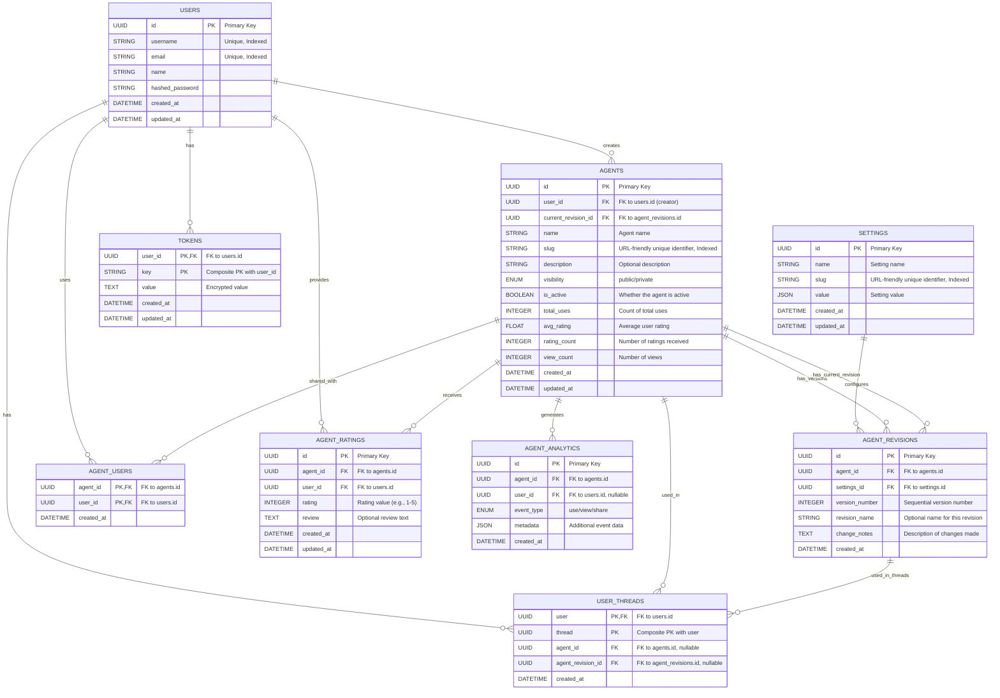

### End Goal

```mermaid
erDiagram
    USERS {
        UUID id PK "Primary Key"
        STRING username "Unique, Indexed"
        STRING email "Unique, Indexed" 
        STRING name
        STRING hashed_password
        DATETIME created_at
        DATETIME updated_at
    }
    
    SETTINGS {
        UUID id PK "Primary Key"
        STRING name "Setting name"
        STRING slug "URL-friendly unique identifier, Indexed"
        JSON value "Setting value"
        DATETIME created_at
        DATETIME updated_at
    }
    
    AGENTS {
        UUID id PK "Primary Key"
        UUID user_id FK "FK to users.id (creator)"
        UUID current_revision_id FK "FK to agent_revisions.id"
        STRING name "Agent name"
        STRING slug "URL-friendly unique identifier, Indexed"
        STRING description "Optional description" 
        ENUM visibility "public/private"
        BOOLEAN is_active "Whether the agent is active"
        INTEGER total_uses "Count of total uses"
        FLOAT avg_rating "Average user rating"
        INTEGER rating_count "Number of ratings received"
        INTEGER view_count "Number of views"
        DATETIME created_at
        DATETIME updated_at
    }
    
    AGENT_REVISIONS {
        UUID id PK "Primary Key"
        UUID agent_id FK "FK to agents.id"
        UUID settings_id FK "FK to settings.id"
        INTEGER version_number "Sequential version number"
        STRING revision_name "Optional name for this revision"
        TEXT change_notes "Description of changes made"
        DATETIME created_at
    }
    
    AGENT_USERS {
        UUID agent_id PK,FK "FK to agents.id"
        UUID user_id PK,FK "FK to users.id"
        DATETIME created_at
    }
    
    AGENT_RATINGS {
        UUID id PK "Primary Key"
        UUID agent_id FK "FK to agents.id"
        UUID user_id FK "FK to users.id"
        INTEGER rating "Rating value (e.g., 1-5)"
        TEXT review "Optional review text"
        DATETIME created_at
        DATETIME updated_at
    }
    
    AGENT_ANALYTICS {
        UUID id PK "Primary Key"
        UUID agent_id FK "FK to agents.id"
        UUID user_id FK "FK to users.id, nullable"
        ENUM event_type "use/view/share"
        JSON metadata "Additional event data"
        DATETIME created_at
    }
    
    USER_THREADS {
        UUID user PK,FK "FK to users.id"
        UUID thread PK "Composite PK with user"
        UUID agent_id FK "FK to agents.id, nullable"
        UUID agent_revision_id FK "FK to agent_revisions.id, nullable"
        DATETIME created_at
    }
    
    TOKENS {
        UUID user_id PK,FK "FK to users.id"
        STRING key PK "Composite PK with user_id"
        TEXT value "Encrypted value"
        DATETIME created_at
        DATETIME updated_at
    }
    
    USERS ||--o{ TOKENS : has
    USERS ||--o{ AGENTS : creates
    USERS ||--o{ USER_THREADS : has
    USERS ||--o{ AGENT_USERS : uses
    USERS ||--o{ AGENT_RATINGS : provides
    SETTINGS ||--o{ AGENT_REVISIONS : configures
    AGENTS ||--o{ AGENT_REVISIONS : has_versions
    AGENTS ||--o{ AGENT_REVISIONS : has_current_revision
    AGENTS ||--o{ USER_THREADS : used_in
    AGENTS ||--o{ AGENT_USERS : shared_with
    AGENTS ||--o{ AGENT_RATINGS : receives
    AGENTS ||--o{ AGENT_ANALYTICS : generates
    AGENT_REVISIONS ||--o{ USER_THREADS : used_in_threads
```