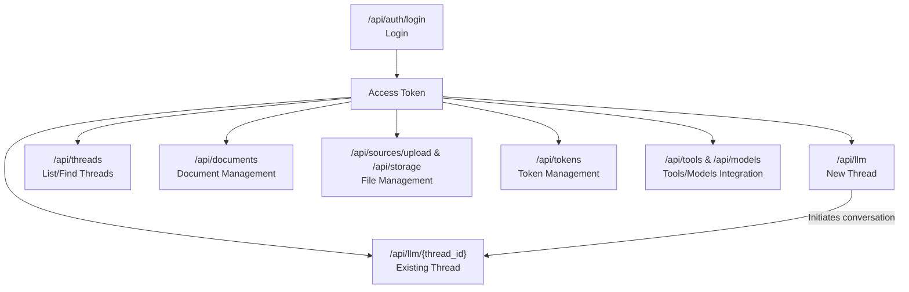

# API Schema

```mermaid
flowchart TD
    %% 1) Define nodes
    A["/api/auth/login\nLogin"]
    B["Access Token"]
    C["/api/llm\nNew Thread"]
    D["/api/llm/{thread_id}\nExisting Thread"]
    E["/api/threads\nList/Find Threads"]
    F["/api/documents\nDocument Management"]
    G["/api/sources/upload & /api/storage\nFile Management"]
    H["/api/tokens\nToken Management"]
    I["/api/tools & /api/models\nTools/Models Integration"]

    %% 2) Connect login to access token
    A --> B

    %% 3) Access token leads to other endpoints
    B --> C
    B --> D
    B --> E
    B --> F
    B --> G
    B --> H
    B --> I

    %% 4) Show how new thread leads to existing thread
    C -->|Initiates conversation| D
```