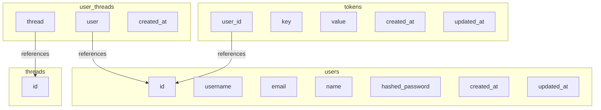

# Database Schema

```mermaid
%% Database Diagram (Flowchart Style)
graph TD
  %% USERS table
  subgraph USERS[users]
    U1[id]
    U2[username]
    U3[email]
    U4[name]
    U5[hashed_password]
    U6[created_at]
    U7[updated_at]
  end

  %% TOKENS table
  subgraph TOKENS[tokens]
    T1[user_id]
    T2[key]
    T3[value]
    T4[created_at]
    T5[updated_at]
  end

  %% USER_THREADS table
  subgraph USER_THREADS[user_threads]
    UT1[user]
    UT2[thread]
    UT3[created_at]
  end

  %% THREADS placeholder (optional)
  subgraph THREADS[threads]
    Th1[id]
  end

  %% Define relationships
  T1 -->|references| U1
  UT1 -->|references| U1
  UT2 -->|references| Th1
```