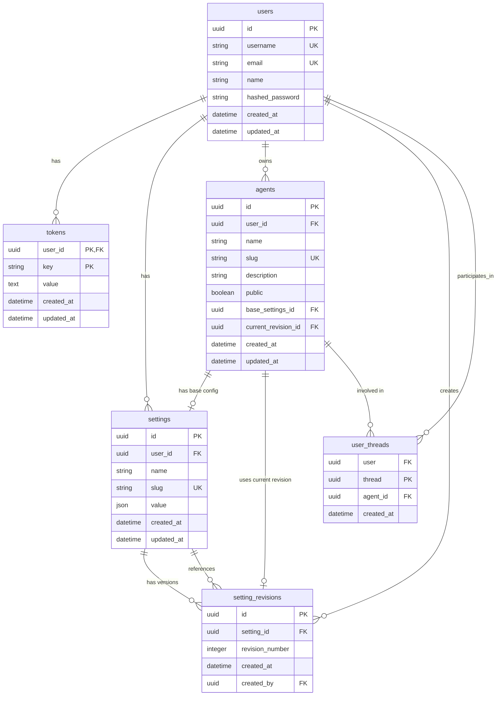

# Database Model (WIP)

The current database schema represents a system for managing AI agents with versioned configurations:

- **Users**: Core account information and authentication
- **Tokens**: Secure storage for third-party access tokens that Chat and Agents utilize.
- **Settings**: JSON configuration values for agents. Can be loosely couple with normal Chat that don't utilize agent configurations.
- **Setting_revisions**: Version history tracker for settings changes of agents.
- **Agents**: AI assistants with base configuration and current revision references
- **User_threads**: Conversation threads linking users with specific agents

The schema supports tracking the full history of configuration changes for agents, with the ability to restore previous versions. Agents reference both their original settings (`base_settings_id`) and their currently active revision (`current_revision_id`). Conversation threads are associated with both users and the specific agent involved in the conversation.

### Table Relationships Summary

- **Users**: Central entity that owns tokens, settings, agents, and participates in threads. Users also create setting revisions.

- **Tokens**: Belong to a user and store encrypted third-party credentials. No connections to other tables.

- **Settings**: Define configurations owned by users. They serve as the base for agents and can have multiple revisions tracking their change history.

- **Setting_revisions**: Track version history of settings. Each revision references a settings record and the user who created it. Agents can reference a specific revision as their current active configuration.

- **Agents**: Convenience layer that bundles settings, revisions, and threads together to provide a simpler API interface. Not essential to core functionality but reduces coupling complexity in the external API.

- **User_threads**: Join users and agents in conversation threads, tracking which agent a user is interacting with in each thread.

This structure allows configuration versioning for agents, with full history tracking and the ability to rollback to previous versions.

